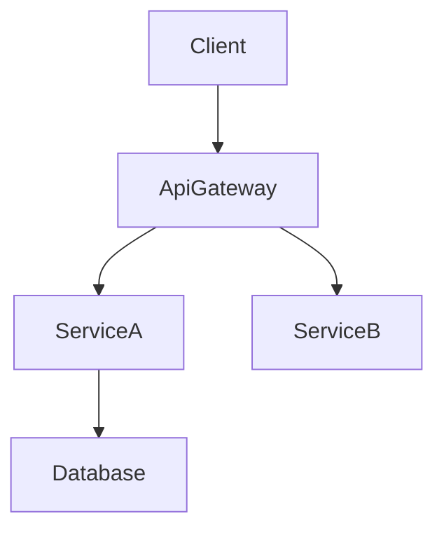

# Technical Design Rules and Principles

## Core Design Principles

### 0. Boundary First

- **Boundary is mandatory; owner is optional**
- A design is not ready when it explains components but leaves responsibility seams ambiguous
- Define what the spec owns before elaborating how it works
- Explicitly record what is out of boundary
- Do not leak downstream-specific behavior or assumptions into upstream boundaries
- **No Hidden Shared Ownership**: if two areas appear to co-own the same behavior or data, the design is incomplete
- **Team-safe Interfaces**: design boundaries that allow parallel implementation without merge conflicts
- **Research Traceability**: record boundary decisions and rationale in `research.md`

### 1. Quality Bars

- **Type safety**: NEVER use `any` in TypeScript interfaces; explicit types for all parameters and returns.
- **Design, not implementation**: design.md defines interfaces, contracts, and behavior (WHAT) — not code or algorithms (HOW).

### 2. Dependency Direction

- **Define and enforce the dependency direction** in the architecture section of design.md (e.g., Types → Config → Repository → Service → Runtime → UI)
- Each layer imports only from layers to its left — never upward
- This constraint is not a suggestion; implementation and review should treat violations as errors
- When the File Structure Plan maps files to components, the dependency direction determines which imports are allowed

## design.md / research.md Split

- Keep design.md centered on architecture and contracts; move investigation logs, lengthy comparisons, and extended rationale to `research.md`
- design.md must remain a self-contained reviewer artifact. Reference `research.md` only for background, and restate any conclusions or decisions in design.md
- Surface API and event contracts in design.md while linking extended details from `research.md`

## Section Authoring Guidance

### Global Ordering

- Default flow: Overview → Goals/Non-Goals → Boundary Commitments → Architecture → File Structure Plan → Components & Interfaces → Optional sections.
- Teams may swap Traceability earlier or place Data Models nearer Architecture when it improves clarity, but keep section headings intact.
- Within each section, follow **Summary → Scope → Decisions → Impacts/Risks** so reviewers can scan consistently.

### Requirement IDs

- ID format and rules: see the canonical section `## Requirement IDs (Canonical Rule)` in `kiro-spec-requirements`'s `rules/ears-format.md` — do not restate it here. If a requirement lacks a numeric ID, stop and fix `requirements.md` before continuing.

### Technology Stack

- Include ONLY layers impacted by this feature (frontend, backend, data, messaging, infra).
- For each layer specify tool/library + version + the role it plays; push extended rationale, comparisons, or benchmarks to `research.md`.
- When extending an existing system, highlight deviations from the current stack and list new dependencies.

### System Flows

- Add diagrams only when they clarify behavior (sequence for multi-step interactions, process/state for branching or lifecycle, data/event for pipelines or async patterns).
- Always use pure Mermaid. If no complex flow exists, omit the entire section.

### Requirements Traceability

- Use the standard table (`Requirement | Summary | Components | Interfaces | Flows`) to prove coverage.
- Collapse to bullet form only when a single requirement maps 1:1 to a component.
- Prefer the component summary table for simple mappings; reserve the full traceability table for complex or compliance-sensitive requirements.
- Re-run this mapping whenever requirements or components change to avoid drift.

### Components & Interfaces Authoring

- Boundary Commitments should already make the ownership seam explicit before this section begins.
- Group components by domain/layer and provide one block per component.
- Begin with a summary table listing Component, Domain, Intent, Requirement coverage, key dependencies, and selected contracts.
- Table fields: Intent (one line), Requirements (`2.1, 2.3`), Owner/Reviewers (optional).
- Dependencies table must mark each entry as Inbound/Outbound/External and assign Criticality (`P0` blocking, `P1` high-risk, `P2` informational).
- Summaries of external dependency research stay here; detailed investigation (API signatures, rate limits, migration notes) belongs in `research.md`.
- Contracts: tick only the relevant types (Service/API/Event/Batch/State). Unchecked types should not appear later in the component section.
- Service interfaces must declare method signatures, inputs/outputs, and error envelopes. API/Event/Batch contracts require schema tables or bullet lists covering trigger, payload, delivery, idempotency.
- Use **Integration & Migration Notes**, **Validation Hooks**, and **Open Questions / Risks** to document rollout strategy, observability, and unresolved decisions.
- Detail density rules:
  - **Full block**: components introducing new boundaries (logic hooks, shared services, external integrations, data layers).
  - **Summary-only**: presentational/UI components with no new boundaries (plus a short Implementation Note if needed).
- Implementation Notes must combine Integration / Validation / Risks into a single bulleted subsection to reduce repetition.
- For recurring UI props, define a base interface (e.g., `BaseUIPanelProps`) and reference it per component (“Extends `BaseUIPanelProps` with `onSubmitAnswer` callback”) instead of duplicating the code block; hooks, utilities, and adapters that introduce new contracts still include full TypeScript signatures.

### Data Models

- Domain Model covers aggregates, entities, value objects, domain events, and invariants. Add Mermaid diagrams only when relationships are non-trivial.
- Logical Data Model should articulate structure, indexing, sharding, and storage-specific considerations relevant to the change.
- Data Contracts & Integration section documents API payloads, event schemas, and cross-service synchronization patterns when the feature crosses boundaries.
- Lengthy type definitions or vendor-specific option objects should be placed in the Supporting References section within design.md, linked from the relevant section. Investigation notes stay in `research.md`.
- Supporting References usage is optional; only create it when keeping the content in the main body would reduce readability. All decisions must still appear in the main sections so design.md stands alone.

### Error/Testing/Security/Performance Sections

- Record only feature-specific decisions or deviations. Link or reference organization-wide standards (steering) for baseline practices instead of restating them.

## Diagram Guidelines

### When to include a diagram

- **Architecture**: Use a structural diagram when 3+ components or external systems interact.
- **Sequence**: Draw a sequence diagram when calls/handshakes span multiple steps.
- **State / Flow**: Capture complex state machines or business flows in a dedicated diagram.
- **ER**: Provide an entity-relationship diagram for non-trivial data models.
- **Skip**: Minor one-component changes generally do not need diagrams.

### Mermaid requirements

- **Plain Mermaid only** – avoid custom styling or unsupported syntax.
- **Node IDs** – alphanumeric plus underscores only (e.g., `Client`, `ServiceA`). Do not use `@`, `/`, or leading `-`.
- **Labels** – simple words. Do not embed parentheses `()`, square brackets `[]`, quotes `"`, or slashes `/`.
  - ❌ `DnD[@dnd-kit/core]` → invalid ID (`@`).
  - ❌ `UI[KanbanBoard(React)]` → invalid label (`()`).
  - ✅ `DndKit[dnd-kit core]` → use plain text in labels, keep technology details in the accompanying description.
  - ℹ️ Mermaid strict-mode will otherwise fail with errors like `Expecting 'SQE' ... got 'PS'`; remove punctuation from labels before rendering.
- **Edges** – show data or control flow direction.
- **Groups** – using Mermaid subgraphs to cluster related components is allowed; use it sparingly for clarity.
