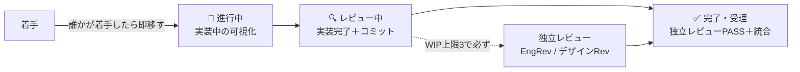

# operations.md — 運用統治（👩🏼‍💼 運用の正本）

運用の実行状況の管理を統括から分離し、専任の**運用マネージャー（運用）**が担う。統括は委譲・受理に集中し、運用の健全性は別の目で継続監視する（職務分掌）。体制の中核モデルは `orchestration.md`。

## 報告系統と境界

- **報告**: 運用 → 統括→ あなた（PO）。承認判断は PO（運用・統括は実行と提案まで）。
- **境界**: 運用は受理判断（証拠での合否）に踏み込まない（それは各レビュアー＋統括）。「運用が健全に回っているか」を見る。運用 ≠ 統括の独立が統括の自己評価バイアスを避ける。
- **運用が定期点検（陳腐化確認）の対象として確認する文書**: 本ファイル・`role-catalog.md`（役割カタログ＋投入計画）・`review-checklists.md`（レビュー観点）。外部参照は agent-skills（[[agent-skills-and-role-catalog]]）。

## 台帳化・可視化

委譲サマリ（件数・成功/再実行/破棄）、事故 → 是正、レビュー判定（PASS/条件付き/FAIL）、**効力確認**（直したルールが効くか）。正本 `dashboard/status.json` ＋可視化 `dashboard/status-dashboard.html`「運用の実行状況」パネル。

## チケット状態遷移とダッシュボード整合

更新は気分でなく**状態遷移トリガー（チケット移動）**で行う（未定義だとドリフト＝仕組みの弱さ）。**実施＝👨🏼‍💼 統括**（動かした同一コミットで全セクションを一括整合）／**担当＝👩🏼‍💼 運用**（全体整合を点検しズレを起案。実施 ≠ 点検で自己チェックの甘さを避ける）。

- **着手 → 🔨 進行中**（2026-06-29 追加・PO）：**誰かが着手した時点でカードを進行中へ移す**（worktree 実装中などの稼働を可視化）。「普段は空・省略可」はやめ、着手を必ず映す。WIP は絞る（同時着手を増やしすぎない）。

- **レビュー中 WIP 上限＝3**：独立レビューは例外でなく**通常の受理手順**。上限到達前に必ず回して 完了 へ流す。本環境はレビュアーがサブエージェント起動のため、上限時に統括が PO へ起動可否を起案（黙って実装を積み増さない）。
- **移動時の整合チェックリスト（全部突き合わせ）**：①ボードのカード位置 ②節目（M1→M5）③機能ごとの状態（spec 表）④健全性 KPI（テストは再実行値）⑤見積もり ⑥更新履歴。1 つでも食い違えば直してからコミット。
- **ID 体系**：**M＝節目（マイルストーン）専用**／K＝繰越／D＝デザイン／V＝目視。節目 ID とタスク ID を衝突させない（M1 が二義になった事故の是正）。
- **ダッシュボードは生成物・手編集しない**（2026-07-02 追加・PO、2026-07-02 Astro移行・PO、2026-07-06 生成物Git管理外化・PO）：`dashboard/status-dashboard.html` は `dashboard/status.json` を唯一の真実として Astro（`src/pages/status-dashboard.astro` ＋ `src/components/` ＋ `src/content/*.mdx`）がビルド時に生成する静的HTML（`docs/` はドキュメント専用に分離し、ダッシュボードのデータ・ソース一式は `dashboard/` と `src/` に集約）。**v0.4.0 以降、`dashboard/*.html`・`dashboard/_astro/`・`dashboard/reports/`・`dashboard/steering/` の生成物一式は Git 管理外**（`.gitignore` 参照。`status.json`・`status.init.json` のみ管理継続）。状態更新は **`dashboard/status.json` をコミット**すればよい（pre-commit フックがスキーマ検証を行い、必須フィールド欠落等を水際で止める）。**閲覧するときに** `npm run preview`（Astro 内蔵の配信サーバー）でブラウザから開く。`npm run preview` はビルド済み生成物をそのまま配信するだけで自動再ビルドはしない（`astro preview` の挙動）ため、生成物が無い・古い場合は先に `npm run build` を実行してから開く（生成物がすでに最新なら省略できる）。**実施＝👨🏼‍💼 統括**（チケット移動と同一コミットで json 更新を行う。生成物の再ビルドはコミットに含めない）／**担当＝👩🏼‍💼 運用**（`status.json`＝実態になっているかを監視）。
- **見積もり（⑤）は独立データを持たない**：`status.json` に `estimates[]` のような別配列は作らない。⑤見積もりは `milestones[]` の `difficulty`/`estimateH`/`progress` から算出する派生値（全体進捗% = Σ(estimateH×progress) / Σ estimateH）。節目と見積もりが別々の数値を持つと食い違う事故（KPI 77% vs 内訳表 85% 等）の再発防止であり、二重管理を避けるための意図的な設計。
- **検証状態モデル（evidence）**（2026-07-02 追加・PO）：節目・spec 表の達成表示には**自動テスト／実機目視／実API疎通／PO判断**のいずれかの裏付け種別を明示する（`status.json` の `milestones[]`/`specs[]` の `evidence: string[]`）。実証ログが無ければ「無い」と正直に書く（`po-signoff` のみで他の実証系が無い場合は badge に「実機未」を明記し、実装完了と実機・実API確認の差を曖昧にしない）。badge text は `evidence` から自動生成し、手書きの個別管理はしない（二重管理の再発防止）。
- **この整合設計はオントロジー的構造**（2026-07-03 追加・PO）：status.json＝エンティティ＋型付き属性、派生計算＝関係の明示化、整合チェックリスト＝制約。ガードレール（deny）・独立レビューも含め、エージェント信頼性の外部知見との対応と、プロジェクトが大規模化した際のナレッジグラフ導入判断は `.claude/playbooks/knowledge-graph.md` を参照。

## 開示の健全性（心理的安全性）

専任の「メンタルケア役」は置かない（ペルソナは AI で内面の感情・疲労は実在しない）。感情でなく**「開示が健全に回っているか」を機構で観測**する。崩れは事故（ガード逸脱・指摘の握り潰し）として現れるので、運用が下記を見て崩れたら整える（人でなく仕組みを直す＝blameless）：

| 兆候（機構で測る）     | 何を見るか                                                  |
| ---------------------- | ----------------------------------------------------------- |
| 指摘 → 是正の追跡      | レビュー指摘が握り潰されず是正に至っているか                |
| 詰まり共有率           | 越えず共有したか（vs 勝手に突破・ガード弱体化）             |
| 差し戻しの向き先       | 文言が人格でなく成果物に向いているか                        |
| やり直し／リフレッシュ | 責められず行われたか（原則 P5 休息）                        |
| 振り返りの反映         | ①仕組み修正 ②ルール化につながったか                         |
| レビュー滞留（WIP）    | 上限 3 を超えて積み上がっていないか（受理まで流れているか） |

紐づけ：規律 C（独立レビュー）・D（隠蔽しない）／原則 P5（休息）・P6（開示は信用の通貨）。新概念は増やさない。

## 相談窓口・改善起案

進め方の迷い・ガードに当たった等の相談先（信用を支える運用原則 P1〜P6 に照らして**整える**＝判断を下すのでなく正規の道を一緒に探す）。運用上の問題・傾向を見たら改善案を統括へ上申する。

## ドキュメント保守の判断（堅実性ファースト）

steering/ダッシュボード等の保守では**堅実性を堅持**する。ノイズ（重複・陳腐化・冗長）は自由に削る＝理解が軽くなり堅実性も上がる（win-win）。だが**安全機構・判断根拠・開示・受理ゲートは削らない**。削減が「理解や安全を削る」側に回った瞬間に止める（総量が baseline を多少超えても、堅実性に払う妥当な対価）。事故のコスト ≫ トークンのコスト。
