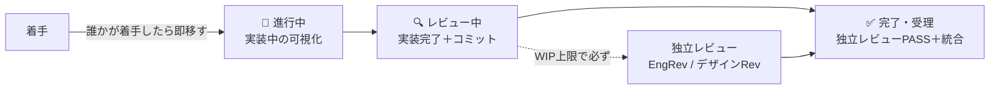

# operations.md — 運用統治（👩🏼‍💼 運用の正本）

運用の実行状況の管理を統括から分離し、専任の**運用マネージャー（運用）** が担う。統括は委譲・受理に集中し、運用の健全性は別の目で継続監視する（職務分掌）。体制の中核モデルは `orchestration.md`。

## 報告系統と境界

- **報告**: 運用 → 統括→ あなた（PO）。承認判断は PO（運用・統括は実行と提案まで）。
- **境界**: 運用は受理判断（証拠での合否）に踏み込まない（それは各レビュアー＋統括）。「運用が健全に回っているか」を見る。運用 ≠ 統括の独立が統括の自己評価バイアスを避ける。
- **定期点検（陳腐化確認）の対象と手順の正本は `.claude/playbooks/full-sdlc.md`**（節目ごとの定常運用）。運用はそれを回す役であり、対象一覧をここに二重に持たない。
- **運用が定期点検で確認するデータ**: `.kiro/specs/*/tasks.md` の `_Model:_`（`STATUS.md` に集計される）が実際に使ったモデルと合っているか（判断基準は `.claude/playbooks/model-assignment.md`）。

## 台帳化

委譲サマリ（件数・成功/再実行/破棄）、事故 → 是正、レビュー判定（PASS/条件付き/FAIL）、**効力確認**（直したルールが効くか）を運用が追う。手書きの専用台帳は持たない（誰も更新せず実態と乖離したため v0.12.0 で撤去した）。工程の状態は `STATUS.md`、セッション中の稼働は `.orchestration/progress.log`、振り返りは `.claude/reports/` を見る。

## チケットの状態遷移

更新は気分でなく**状態遷移トリガー（チケット移動）** で行う（未定義だとドリフト＝仕組みの弱さ）。**実施＝👨🏼‍💼 統括**（動かした同一コミットで導出元＝`tasks.md` のチェックボックスと `spec.json` の承認状態を更新する）／**担当＝👩🏼‍💼 運用**（導出元と実態のズレを点検し起案。実施 ≠ 点検で自己チェックの甘さを避ける）。

- **着手 → 🔨 進行中**（2026-06-29 追加・PO）：**誰かが着手した時点でカードを進行中へ移す**（worktree 実装中などの稼働を可視化）。「普段は空・省略可」はやめ、着手を必ず映す。WIP は絞る（同時着手を増やしすぎない）。

- **レビュー中 WIP 上限**：M/L プリセットは 3。S プリセットは 1〜2 に下げる（プリセットの選択と記録は `role-catalog.md`）。独立レビューは例外でなく**通常の受理手順**。上限到達前に必ず回して 完了 へ流す。本環境はレビュアーがサブエージェント起動のため、上限時に統括が PO へ起動可否を起案（黙って実装を積み増さない）。
- **ID 体系**：**M＝節目（マイルストーン）専用**／K＝繰越／D＝デザイン／V＝目視。節目 ID とタスク ID を衝突させない（M1 が二義になった事故の是正）。
- **`STATUS.md` は生成物・手編集しない**：`npm run status` が `.kiro/specs/*/spec.json`・`tasks.md`・`.kiro/steering/role-catalog.md` から導出し、pre-commit フックが導出元の変更を検知して再生成する。状態更新は**導出元をコミット**すればよい（`tasks.md` のチェックボックス・`spec.json` の承認状態）。**実施＝👨🏼‍💼 統括**（チケット移動と同一コミットで導出元を更新する）／**担当＝👩🏼‍💼 運用**（導出元＝実態になっているかを監視）。

## 開示の健全性（心理的安全性）

専任の「メンタルケア役」は置かない（ペルソナは AI で内面の感情・疲労は実在しない）。感情でなく **「開示が健全に回っているか」を機構で観測**する。崩れは事故（ガード逸脱・指摘の握り潰し）として現れるので、運用が下記を見て崩れたら整える（人でなく仕組みを直す＝blameless）：

| 兆候（機構で測る）     | 何を見るか                                                                 |
| ---------------------- | -------------------------------------------------------------------------- |
| 指摘 → 是正の追跡      | レビュー指摘が握り潰されず是正に至っているか                               |
| 詰まり共有率           | 越えず共有したか（vs 勝手に突破・ガード弱体化）                            |
| 差し戻しの向き先       | 文言が人格でなく成果物に向いているか                                       |
| やり直し／リフレッシュ | 責められず行われたか（原則 P5 休息）                                       |
| 振り返りの反映         | ①仕組み修正 ②ルール化につながったか                                        |
| レビュー滞留（WIP）    | 採用中プリセットの上限を超えて積み上がっていないか（受理まで流れているか） |

紐づけ：規律 C（独立レビュー）・D（隠蔽しない）／原則 P5（休息）・P6（開示は信用の通貨）。新概念は増やさない。

## 相談窓口・改善起案

進め方の迷い・ガードに当たった等の相談先（信用を支える運用原則 P1〜P6 に照らして**整える**＝判断を下すのでなく正規の道を一緒に探す）。運用上の問題・傾向を見たら改善案を統括へ上申する。技術的回答そのものの妥当性検証は窓口ではなく別の常設席（🧑🏼‍🏫 PO技術検証、`role-catalog.md`「PO技術検証の charter と境界」）が担う。

## ドキュメント保守の判断（堅実性ファースト）

steering・docs 等の保守では**堅実性を堅持**する。ノイズ（重複・陳腐化・冗長）は自由に削る＝理解が軽くなり堅実性も上がる（win-win）。だが**安全機構・判断根拠・開示・受理ゲートは削らない**。削減が「理解や安全を削る」側に回った瞬間に止める（総量が baseline を多少超えても、堅実性に払う妥当な対価）。事故のコスト ≫ トークンのコスト。
