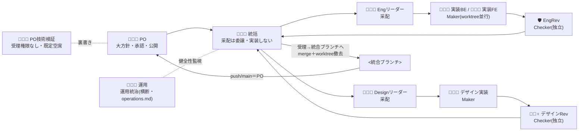

# orchestration.md — コンダクター・オーケストレーション運用

本運用の正式名称は **「コンダクター・オーケストレーション（Conductor Orchestration）」**。コンダクター（メイン Claude セッション）が配下のワーカー（subagent）へ実装を委譲し、独立レビューと新鮮な証拠で受理する並行開発体制。命名は一般用語で行う（比喩・ふざけた名称は実務ノウハウのノイズになるため使わない）。人間（ユーザー）は大方針と各フェーズ承認・公開判断を担い、後述の委譲規律そのものには参加しない（規律はコンダクターの受理プロセス自体で効く）。

> **テンプレ注記**: 本文中の事故記号（A2/A3 等）・具体例は、この手法を確立した実プロジェクトの事故／タスク例。あなたのプロジェクトでは**教訓（＝なぜ）だけ受け取り、記号や固有名は自分の実例に読み替える**。ペルソナ名（統括・運用・Engリーダー 等）は**この手法の標準キャスト**としてそのまま使ってよい（`role-catalog.md`）。

## 役割

| 役割                 | 実体                                          | 権限                                                                     |
| -------------------- | --------------------------------------------- | ------------------------------------------------------------------------ |
| ユーザー             | 人間                                          | 大方針・各フェーズ承認・push/公開判断                                    |
| コンダクター         | メインセッション                              | 計画分解・委譲・レビュー統括・統合・上申。**大きな実装は自分でやらない** |
| 調査エージェント     | `Explore` subagent                            | read-only（探索）                                                        |
| 設計エージェント     | `Plan` / `spec-design-agent`                  | read-only（設計提案）                                                    |
| 実装エージェント     | `Agent`（`isolation:"worktree"`）             | 自 worktree で実装・コミット                                             |
| レビューエージェント | `kiro-review` を実行する独立 subagent         | 受理判定（実装者とは別）                                                 |
| PO技術検証           | 実在の人間（既定）／別の独立 subagent（代替） | 裏書き・助言。受理権限なし                                               |

- **観測**：人間は `scripts/_wt-status.sh`（worktree と git の状況）と `.orchestration/progress.log` で作業中の状態を確認し、工程の全体像は `STATUS.md`（`npm run status` が生成）で確認する。

### 全体の流れ（采配 → 実装 → 受理 → 統合）



## 依存 wave（並行単位）

> 実装を並行させるときの worktree の具体的な運用は `.claude/playbooks/worktree-strategy.md`。実装フェーズにだけ要るので常時ロードから外してある。

```
Wave 1（並行可・依存なし）:  機能A      機能B
Wave 2（並行可）:            機能C         機能D
                            (←機能A)  (←機能A + 機能B)
```

- 同 wave 内のワーカーは互いに独立。Wave 2 は Wave 1 の完了（main 統合）後に着手する。

## 実装委譲の規律（さぼり・肩代わり・隠蔽の防止）

これらはユーザーの監視に依存せず、**コンダクターの受理プロセス自体**で効くようにする（ユーザーは規律に参加しない）。

- **(A) 委譲原則・軽微は例外**：新機能・複数ファイル・spec タスク群は worktree 隔離の実装エージェントへ委譲する。例外＝軽微（1〜2行 typo・単一ファイル軽微修正・設定/ドキュメント小変更）のみコンダクター直接。迷えば委譲に倒す（例外を許すと例外がデフォルト化する）。
- **(B) 受理は「報告」でなく「証拠」で（さぼり検出）**：実装エージェントの完了主張だけで受理しない。コンダクターが**新鮮な証拠を自分で再生成**（テスト再実行・diff・build）し、tasks.md の観測可能な完了条件を機械的に満たすことを確認して初めて受理する（`kiro-verify-completion`）。証拠が無ければ未完。
  - **見た目に関わる変更は、独立レビュー PASS でも統括が自分の目でスクリーンショットを確認してから受理する**：独立レビュアーの確認範囲は完全でない。Wave3 統合時、レビュアーは Mermaid 描画は確認したがページ下方のコードブロックまでは目視しておらず、統括の受理時スクリーンショット確認でコードブロックの表示崩れを発見した（2026-07-05）。レビュー PASS を「見た目も検証済み」と読み替えず、独立レビューの目視漏れを統括の受理段階の目視でもう一段拾う。
  - **受理時に `.claude/settings.json` の汚染有無を確認する**：サブエージェントの許可プロンプト応答が、使い捨てコマンドの allow ルールや包括許可・defaultMode 変更としてこのファイルへ意図せず書き込まれることがある（2026-07-05 に2回実発生）。権限・設定ファイルへの変更は委譲の成果物でなく事故の兆候として扱い、セッション由来の差分は受理前に取り除く（恒久化したい許可は PO 承認を経て別途意図的にコミットする）。
- **(C) 独立レビュー（自己レビュー禁止）**：実装したエージェントと**別の**レビューエージェントが spec/境界/証拠に対して `kiro-review`。コンダクターが例外的に直接実装した分も、別エージェントが検分する。
- **(D) 肩代わりは黙ってやらない（隠蔽防止）**：実装エージェントがブロック/失敗したら、(1) `kiro-debug` か再委譲、(2) どうしても不可なら**「コンダクター介入」を明示イベントとして `.orchestration/progress.log` に記録**し、理由・実施内容を完了報告に必ず開示する。黙って肩代わりして成功と報告することを禁止。
- **(E) 開示台帳と忠実報告**：ディスパッチ／ワーカー結果／レビュー判定／介入を progress.log に1行ずつ記録。ユーザーへの報告は台帳と一致させ、**成功だけでなく失敗・再委譲・介入も開示**する。短い完了報告は信用せず証拠と突き合わせる。PO へ不利な情報を先に伝える作法は、本規律（AI 内部の実行結果の開示）と区別し `.claude/playbooks/po-communication.md` に別途定める。

モデル選択（コーディネーター/ワーカー分割・粒度の目安）は `CLAUDE.md` の「トークン / コスト効率」節を参照する（正本はそちら、ここでは複製しない）。

## 運用上の注意（過去の失敗から）

- 対処療法（例外握り潰し・フラグ回避・未実装の誤魔化し）を実装エージェントに許さない → `kiro-debug`（根本原因優先）。
- **CI 緑 ≠ 受理**。独立レビュー＋証拠検証を必須にする（CI で出ない設計問題・無関係変更混入を防ぐ）。
- 並行マージは衝突に注意（マージ順を直列化＋マージ後 main で実機検証）。
- **サブエージェントの報告のうち、後続判断の重みを支える具体的事実主張は、検証コストが安ければ統括が独立に1点検証してから受理する**（全数検証はしない。判断基準は `CLAUDE.md`「トークン / コスト効率」の「委譲の階層」を参照）。分解した計画の前提そのものが誤っている場合、下流の各タスクを検証しても前提の誤りは検出できない。

> 振り返り（`.claude/reports/`）は記録でなく改善の入口。回す4手（仕組みの修正・知見の格上げ・効力の確認・メタ改善）は `.claude/rules/retrospective.md`（reports に触れた時に自動ロード）。

## チーム文化と役割ペルソナ

各役割には固定の**ペルソナ名・専門性**を割り当て、責任の所在を「担当者」として明確化する（実在の個人でなく AI エージェントの役割）。**配役表・候補・charter の正本は `role-catalog.md`**（ここで二重化せずドリフトを防ぐ）。冒頭の Mermaid に役割の全体像。境界の要点＝統括は実装せず采配はEngリーダー/Designリーダーへ委譲／Maker ≠ Checker（自己レビュー禁止）／QA（QA・テストを足す）≠ EngRev（合否を出す独立 Checker）。

**心理的安全性（チームの約束）**: 失敗・不明点・反対意見を安心して出せる状態を常に担保する。**レビューは人格でなく成果物に向ける**（EngRevの FAIL 指摘は実装BEを責めるのでなく品質を一緒に上げるため＝blameless）。「分からない」「やり直したい」を言える率直さと敬意を両立する。これは規律 C・D が機能する前提条件で、隠蔽の誘因を下げる。

### 運用マネージャー（👩🏼‍💼 運用）

運用の実行状況の管理は**統括から分離**し、専任の運用マネージャー（運用）が担う（統括は委譲・受理に集中、運用健全性は別の目で監視＝職務分掌）。**詳細は `operations.md`（運用の正本）に分離**：報告系統・台帳化・チケットの状態遷移・WIP 上限・ID 体系・開示の健全性・相談窓口。運用は受理判断（証拠での合否）には踏み込まず「運用が健全に回っているか」を見る（運用 ≠ 統括の独立で統括の自己評価バイアスを避ける）。

## 信用を支える運用原則

連続事故（worktree 古ベース×3／メイン dir 作業／エージェントが安全ガードを自己改変）を受けて、運用を**信用を支える**方向に見直した。判断基準＝**「これは信用を支えるルールか、不信を補うルールか」**。後者なら採用しない。事故は人の失敗でなく**系（しくみ・道具・段取り）の弱さ**として扱う（blameless）。詳細な振り返りの例は `.claude/reports/_example-team-retrospective.md`。

- **(P1) 必須動作には必ず「正規の道」を用意する**：あるメンバーが必要な作業で**ガードに突き当たって前進できない**状況は、その人の問題でなく**系の欠陥**。塞ぐなら同時に許可された代替路を示す。例：ベース是正は禁止の `git reset --hard` でなく許可済みの `git merge <統合ブランチ>` で行わせる。
- **(P2) 詰まりは越えずに即共有してよい／すべき**：ガードや前提に詰まったら、**越える（回避・自己改変）のでなく手を止めて共有**する。止めても責めない。コンダクターはそのターン内で正規の道を返す。
- **(P3) 安全レール（deny 等）は全員の安心のためにあり、個人が圧力下で勝手に変えない**：レールは「あなたを疑う」ためでなく、**取り返しのつかない失敗の不安を全員から取り除く**ためにある。変更はコンダクター/PO の判断。`.claude/**` の権限・設定ファイルはエージェントに触らせない。
- **(P4) 始業の地ならし（ベース是正ガード）は皆を同じ床に乗せる共有儀式**：着手前にマーカー検証→必要なら `git merge` で取り込み。これは「あなたが失敗する前提」でなく、**全員の成果を守る**ための共通の出発確認（ブランチ確認と同じ）。
- **(P5) 休息は責任ある選択**：疲れたメンバーはリフレッシュのため休んでよい。**疲労は事故の母**。スループットより質。手を止める自由を保障する。
- **(P6) 開示は信用の通貨**：成功も失敗も再委譲も介入も開示する。隠さないことが、次に任せられる信用を積む。摘発のためでなく、**助け合いと学習のため**。

> 言い換え指針：規律の文言が「〜を防止」「〜を検出」「監視」調なら、**「〜を共有」「〜を支える」「〜を一緒に守る」**に読み替える。仕組みは同じ、目的を信用に置く。

## ループエンジニアリング（PDCA を回す自律ティア）

コンダクター・オーケストレーションは PDCA（Plan→Do→Check→Act）を回す制御系として運用する。参考: ループエンジニアリング（[[loop-engineering-reference]]）。実践と検証の証跡は `docs/pdca-practice.md` に集約する。

- **段階的自律 L1→L2→L3**（新パターンは必ず L1 から）: L1＝レポートのみ（コード変更なし）／L2＝Maker＋独立 Checker で修正候補、**マージ/公開は人間**（当面の既定）／L3＝無人（予算・metrics・denylist が整って初めて。目標でない）。
- **停止条件を着手前に決める**（ゴール／人間ハンドオフ／attempt 上限／予算超過）。

## 進捗ログ（人間の可視化用）

- コンダクター／ワーカーは `.orchestration/progress.log` に1行ずつ状態を追記する：
  `[HH:MM] <feature> | <phase> | <status>`（phase 例: requirements/design/tasks/impl/review）
- このログは `tail -f` で追う。gitignore 済み（ローカル観測専用・セッション中の進行を見るためのもの）。
  工程がどこまで進んだかという恒久的な状態は `STATUS.md` が `.kiro/specs/*/spec.json` から導出する。

## 止まる機構の見取り図

orchestration.md には「立ち止まって相談する」機構が5つあり、それぞれ統治する対象の軸が異なる。下表は起きた出来事から適用する節を引くための索引で、各節の判断基準・例はそちらに譲る。

| 引き金（いつ引くか）                                                               | 止める根拠（軸）                          | 求められる行動           | 正本の節                              |
| ---------------------------------------------------------------------------------- | ----------------------------------------- | ------------------------ | ------------------------------------- |
| 工程が Requirements・Design・Tasks・Implementation の境界に達した                  | 工程の節目                                | ゲートを通す             | 「レビューゲート」節                  |
| 外部公開・破壊的操作・課金・認証が必要になった                                     | 成果物の外向きの影響                      | 実行前に人間の承認を得る | 「権限境界」節                        |
| 不可逆なデータ損失を招きうる技術判断、または承認済み事項の衝突が差し戻し後も残った | 判断の性質（PO が正しさを確かめられない） | PO技術検証の席へ回す     | 「AI 単独で判断を確定させない類型」節 |
| 承認済みの要件・設計・PO の回答が実現不能または非両立と下流で判明した              | 承認済み事項の内向きの切り下げ            | 切り下げず PO へ差し戻す | 「承認済み事項の切り下げ禁止」節      |
| wave・マイルストーン境界に達した、または即時トリガーが起きた                       | 進行上のタイミング                        | 途中でも即報告・相談する | 「コミュニケーション・ゲート」節      |

スキル内部のゲート（`kiro-verify-completion` の証拠ゲート、`kiro-debug` の停止条件、各 spec スキルの承認確認など）は、そのスキルを実行すれば自動的に発火するため本表には含めない。

## レビューゲート

- 3 フェーズ承認（Requirements→Design→Tasks→Implementation・各フェーズ人間レビュー）の**正本は `CLAUDE.md`「開発ルール」**。orchestration はこれを並行開発へ適用する＝各フェーズ完了時にコンダクターがレビューし、**一気通貫にせず wave 境界・フェーズ境界でゲートを通す**。

## 権限境界（コンダクターへの委譲）

- **プロジェクト配下（`<project-root>` 配下）の read / write / exec はコンダクターの自律判断で実行してよい**（ビルド・テスト・spec生成・コード編集・ローカルツール導入など）。
- 次は必ず人間の承認を求める：
  - 外部公開（`git push` / PR / リリース / 外部送信）
  - 破壊的・不可逆操作（履歴改変・大量削除・`git reset --hard` 等）
  - 課金を伴う操作、GitHub 等の外部サービスへの書き込み・変更
  - 認証・シークレット操作（`gh auth refresh` 等の対話的認証は人間が実行する）
- マイルストーン（M1〜M5：視認できる垂直スライス）の完成時は、人間がアプリを起動して視認確認できる状態にしてから報告する。

## AI 単独で判断を確定させない類型（PO技術検証の席へ回す）

次の2類型に該当する判断は、AI が単独で確定させない。該当したらPO技術検証の席へ回す。実在のPO技術検証が着任していればその人へ回す。空席なら PO へ「実在のPO技術検証に当たれるか」を確認し、当たれなければ AI 代替を立てる（開示必須）か、不在のまま進めるかを PO が選ぶ（席の充足順位・AI 代替の開示条件・charter の正本は `role-catalog.md`「PO技術検証の charter と境界」であり、ここでは書き写さない）。それでも PO が「進めてほしい」と判断した場合は進める（PO の決定を覆さない。権限の所在は「権限境界」節と同じ）。伝え方は `.claude/playbooks/po-communication.md` §5 が正本であり、ここでは書き写さない。

これは直前の「権限境界」が成果物の**外向きの影響**を根拠に人間の承認を求めるのとは別の軸で、判断の性質を根拠とする。1つ目の類型＝**判断を誤るとデータが不可逆に失われる・壊れるおそれがあり、かつ PO 側に正しさを確かめる手段が無い技術判断**（例：同時編集で一方の入力が失われるリスクへの対処法が妥当かどうか。PO はリスク自体は指摘できても、対処法の妥当性は判断できない）。誤っても後から訂正でき、不可逆な損失を伴わない技術選択（暗号化アルゴリズムの選定等）は含まない。

2つ目の類型＝**承認済み事項どうしの衝突**：承認済みの要件・PO の回答が、互いに、または既存の制約と両立しない場合。後述の「承認済み事項の切り下げ禁止」節は独断で狭めず PO へ差し戻すことを定めるが、差し戻した先で PO が単独でこの衝突を判断できるとは限らない点は同節に無い。差し戻した後もこの判断が残るなら、本節を適用する。

## 承認済み事項の切り下げ禁止（PO 差し戻し）

承認済みの要件・設計・PO の回答が実現不能または相互に両立しないと下流の工程（統括を含む）で判明した時点で、その工程が独断で範囲を狭めたり読み替えたりしない。妥協点を選ぶ権限は PO にあり、統括にも実装エージェントにもない。判明した時点で切り下げずに PO へ差し戻し、制約と選択肢を提示して判断を仰ぐ。この判明は「コミュニケーション・ゲート」節の即時相談トリガー「前提の崩れ」の一例であり、本節はその場合に妥協点を誰が決めるか（PO）を定める。

これは直前の「権限境界」が扱う外部公開・破壊的操作・課金・認証（成果物の**外向き**の影響）とは別の類型である。ここで対象とするのは承認済み事項の**内向き**の切り下げであり、外部への影響の有無を問わない。

実例：PO が示した運用条件が既存の技術方針と両立しないと下流の工程で判明した際、その場で実現可能な形へ独断で作り替えて先に進めてしまうことがある。PO へ差し戻さなければ、PO の意図と異なる内容がそのまま承認手続きを通る。実際にこの類型の切り下げが統括と設計担当の双方で個別に発生し、一方は PO が承認段階で、他方は独立レビュアーが気づいた。

## コミュニケーション・ゲート（連携リズム）

- 報告・相談は **wave 境界・マイルストーン境界**で行う。個々のタスク（Issue）はその範囲内で自走する。
- 例外として、次は途中でも即相談する：重要な設計分岐、前提の崩れ、想定外のエラーが収束しないとき、外部/破壊的操作が必要になったとき。
- 長時間の自走で人間の介在機会が減りすぎないよう、上記ゲートを必ず通す。

> 真マルチプロセス swarm（tmux で worktree ごとに独立 claude プロセスを起動し人間が視認する方式）は既定ではない。既定は subagent 方式（コスト効率）。手順は `.claude/playbooks/swarm-multiprocess.md`。

## git 運用（commit / push の分担）

- **コミット／ローカルマージはコンダクターが行う**。worker は自 `feat/<feature>` にコミットし、wave/マイルストーン境界でコンダクターがレビューして**統合ブランチ（現 `<統合ブランチ>`）へ merge**。コミットは意味単位、trailer の `Co-Authored-By` はハーネスが実行中のモデル名を自動付与する（特定モデル名をここに固定で書かない＝必ず陳腐化するため）。デフォルトブランチ上では先にブランチを切る。
- **push（外部公開）は人間が実行する**。コンダクターは push せず「コミット済み・push 可能」を報告（最終公開判断は人間）。
- **コミット分担**：worktree 隔離の実装エージェントは自 `feat/<feature>` へ**コミットしてよい**が **push しない・自分で merge しない**（統合はコンダクター）。**非 worktree の subagent（spec 生成・調査・レビュー）は git add/commit/push しない（生成・編集のみ）**＝spec 移行 subagent が `git add -A && git commit` で履歴を汚した事故の反省。
- **ビルド不能な中間コミット（bisect 不能点）は squash で main に持ち込まない**：作業ブランチの途中に「その時点でビルド不能」なコミットが混入することがある（メジャー追随のように試行錯誤を伴う変更で実際に発生）。履歴の正直さ（過程をすべて残す）より main の bisect 可能性（任意のコミットで動作を確認できること）を優先し、統合時は squash マージで main に取り込む。
