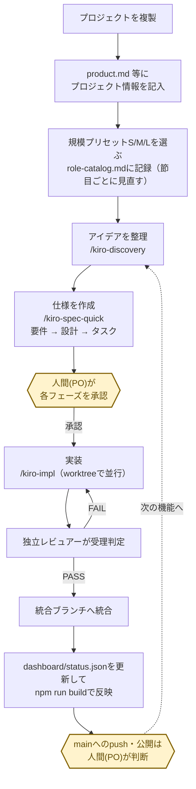
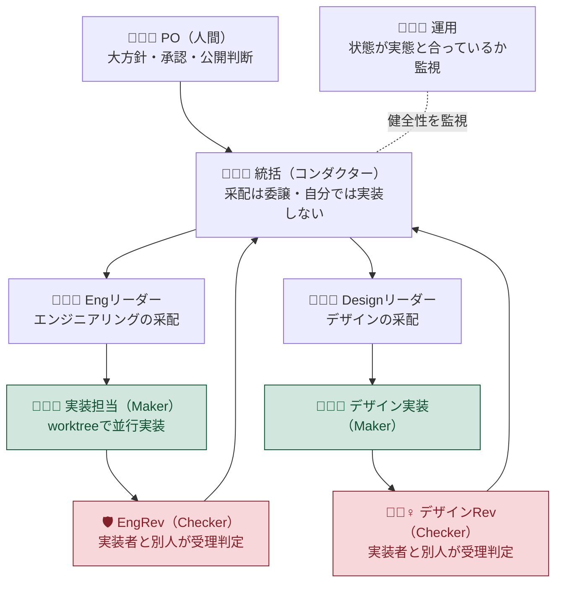
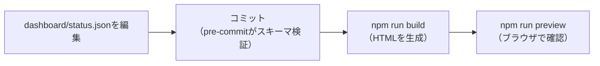
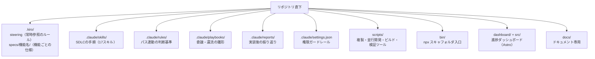

# conductor-sdlc-template

**AIエージェント主体の開発**を、コンダクター・オーケストレーション（メインのAIセッションが指揮役となり、複数のワーカーへ実装を割り振り独立レビューで受け取る体制）＋Kiro Spec-Driven Development（要件→設計→タスクの3段階承認で仕様化してから実装する進め方）＋可視化ダッシュボードで回すためのプロジェクト・テンプレート。実プロジェクト（Tauri デスクトップアプリ）で確立した手法・体制・ノウハウ・ダッシュボードの骨格を、次のプロジェクトの起点として切り出したもの（経緯は [`CHANGELOG.md`](CHANGELOG.md) の「成り立ち」を参照）。

## すぐに始める

**前提**: Node.js 22.12 以上・npm 10 以上（`node -v` / `npm -v` で確認。古ければ [nvm](https://github.com/nvm-sh/nvm) で更新）。

```bash
npx github:kumamoto-kouki/conductor-sdlc-template ~/projects/my-app "マイアプリ"
cd ~/projects/my-app
npm install
npm run build
npm run preview
```

`npm run preview` が表示する URL の末尾に **`/status-dashboard`** を付けて開く（例: `http://localhost:4321/status-dashboard`）。初期ダッシュボードが出れば成功。

<details><summary>うまくいかないとき</summary>

- `could not determine executable to run` … npm が古い。nvm で 10 以上に更新する。
- `Permission denied` / `複製先ディレクトリを作成できません` … 書き込めるパス（`~/projects/<名前>`）を指定する。
- `複製先が既に存在します` … 別の新規パスにする（既存は上書きしない）。

</details>

## インストール後にすること

対象プロジェクトのフォルダで Claude Code を開いて進める。

1. **`.kiro/steering/` の `product.md` / `tech.md` / `structure.md` を記入**（`/kiro-steering` でも可）— AI に渡る前提知識
2. **規模プリセット S/M/L を選ぶ** — `.kiro/steering/role-catalog.md`「配役表（現状）」冒頭の**採用中プリセット**行に記入し、配役表の 状態 列を合わせる（実装者(Maker)と検査者(Checker)を別人にする規律は規模に関わらず不変）
3. **最初の機能を作る**: `/kiro-discovery "アイデア"` → `/kiro-spec-quick {機能名}` → `/kiro-impl {機能名}`（各段階を承認）
4. **進捗を反映**: `dashboard/status.json` を更新して `npm run build`

状況確認はいつでも `/kiro-spec-status {機能名}`。

## 全体の流れ（1周）

複製してから機能が1つ育ってダッシュボードに反映されるまでの1周は次のとおり。人間（PO＝プロダクトオーナー）が承認するポイントを色つきで示す。



**worktree**（同じgitリポジトリを複数の作業ディレクトリへ同時展開し、並行実装時のファイル衝突を防ぐ仕組み）を使い、複数の実装が同時並行で進む。承認は人が行い、それ以外の受理判定（独立レビュー）は仕組みで回す。

## 体制（誰が何をするか）

実装する人（Maker）と検査する人（Checker）は必ず別にする（自己レビュー禁止）。



図は **M（標準）プリセット**の体制。S/M/L でどの役を置くかは `.kiro/steering/role-catalog.md`「規模別プリセット（S/M/L）」を参照する。

## 画面で進捗を見る

進捗の唯一の真実は `dashboard/status.json` で、これを Astro（静的サイト生成ツール）がビルド時にHTMLへ変換する。**`dashboard/status-dashboard.html` はビルド生成物であり手編集しない**。



- 状態を変えたら（着手・進行中・レビュー中・完了）その都度 `status.json` を編集してコミットする。コミット時に pre-commit フックが `src/lib/schema.mjs` のスキーマで検証し、必須フィールドの欠落など明らかな入力ミスをその場でブロックする。
- 見るときは `npm run build` → `npm run preview` を実行し、表示された URL に **`/status-dashboard`** を付けて開く（＝ダッシュボード本体。**正式な閲覧方式**）。root `/` にトップページは無いので必ずパスを付ける。他ページ（`/overview`・`/reports`・`/steering`）へは画面内のナビから移動できる。`npm run preview` は既にある生成物を配信するだけで自動ビルドしないため、生成物が無い・古い場合は先に `npm run build` を行う。
- パス無しで手早く見たいときは、生成ファイル `dashboard/status-dashboard.html` を `file://` で直接開いてもよい（その場合は Mermaid 図が実描画されない（進捗・ボード・KPI 等のテキスト情報は読める）**フォールバック表示**になる）。

## 中身の地図



| 要素                   | 場所                                                   | 内容                                                                                                                                                                                                                                                                                          |
| ---------------------- | ------------------------------------------------------ | --------------------------------------------------------------------------------------------------------------------------------------------------------------------------------------------------------------------------------------------------------------------------------------------- |
| SDLC エンジン          | `.claude/skills/kiro-*`                                | Discovery→Requirements→Design→Tasks→Impl→Review→Verify の 17 スキル                                                                                                                                                                                                                           |
| 体制・運用（正本）     | `.kiro/steering/`                                      | `orchestration.md`（中核モデル）／`operations.md`（運用統治）／`role-catalog.md`（配役）／`review-checklists.md`（受理観点）／`writing-standards.md`（日本語技術文書の規範）／`README.md`（索引）                                                                                             |
| 判断基準（lazy）       | `.claude/rules/`                                       | パス連動で必要時だけ読む規約。同梱: `dashboard-verification.md`／`lib-unit-testing.md`／`retrospective.md`／`steering-consistency.md`。スタック依存の参考例は `_examples/`（先頭 `_` は glob に当たらずロードされない）                                                                       |
| プレイブック           | `.claude/playbooks/`                                   | `delegation.md`（委譲雛形）／`full-sdlc.md`（超上流〜保守運用マッピング）／`discovery-personas.md`（代弁ペルソナ・FDE charter）／`swarm-multiprocess.md`（真マルチプロセス swarm）／`testing-strategy.md`（テスト戦略）／`knowledge-graph.md`（大規模化判断）／`template-feedback.md`（還流） |
| セッション報告         | `.claude/reports/`                                     | 作業メモ・中間レポート。恒久内容は書いた時点で `CHANGELOG.md`／正本へ直接記録し、レポート自体は随時削除できる                                                                                                                                                                                 |
| ガードレール           | `.claude/settings.json`・`.claude/hooks/`              | 破壊的操作の deny・作業系の allow／`format-on-edit.mjs`（編集後の自動整形）                                                                                                                                                                                                                   |
| 並行開発の道具         | `scripts/`・`.githooks/`                               | `swarm-up.sh`／`swarm-down.sh`／`dev-dashboard.sh`（tmux 観測画面）／`_wt-status.sh`（worktree 状況の内部ヘルパ）／`pre-commit`（`status.json` スキーマ検証）                                                                                                                                 |
| セットアップ・還流     | `bin/`・`scripts/`・`VERSION`                          | `bin/create.mjs`（`npx` 入口の薄いラッパ）／`init-project.sh`（複製・初期化の正本）／`package.scaffold.json`（複製先へ配る `package.json`）／`collect-template-feedback.sh`（派生プロジェクトからの知見収集。派生元は `TEMPLATE_VERSION` で追跡）                                             |
| 可視化                 | `dashboard/`＋`src/`（Astro）                          | `status.json`（唯一の真実）＋Astro（`npm install`＋`npm run build`）でHTML生成。ページは `status-dashboard`／`overview`／`reports`／`steering`。生成物自体はGit管理外（後述）。`docs/` はドキュメント専用に分離                                                                               |
| プロダクト記憶（雛形） | `.kiro/steering/product.md`・`tech.md`・`structure.md` | 空テンプレ（記入して使う）                                                                                                                                                                                                                                                                    |

npm スクリプトは `dev`（開発サーバ）／`build`（HTML生成）／`preview`（生成物の配信）／`serve`（簡易配信）／`verify`（ダッシュボードと正本の整合検証）。

## この進め方のルール

**委譲規律 A〜E**（実装を任せる・任された側が受け取る、それぞれの局面での判断基準。正本は `.kiro/steering/orchestration.md`）を平易に書くと次のとおり。

- **A（委譲原則）**：新機能や複数ファイルにまたがる作業は、隔離された作業コピー（**worktree**）で動く実装エージェントへ任せる。1〜2行の typo 修正のような軽微な変更だけ統括が直接行う。
- **B（証拠で受理）**：「できました」という報告だけで完了にしない。統括がテスト・ビルドを自分で再実行し、仕様の完了条件を機械的に満たすことを確認してから受理する（`kiro-verify-completion`）。
- **C（独立レビュー）**：実装した人（Maker）と検査する人（Checker）は必ず別にする（自己レビュー禁止、`kiro-review`）。
- **D（肩代わりは黙ってやらない）**：実装が詰まったら根本原因を調べる（`kiro-debug`）か別の担当へ委譲し直す。どうしても統括が代わりに手を動かす場合は、その旨を記録に残し完了報告で開示する。
- **E（開示台帳）**：委譲・レビュー判定・介入を記録し、成功だけでなく失敗・再委譲・介入も報告する。短い完了報告だけを信用せず証拠と突き合わせる。

そのほかの土台:

- **worktree 戦略（ベース是正ガード）**：実装エージェントが作業を始める前に、既存の成果物が本当に存在するかをマーカーファイル等で機械的に検証する。欠けていれば `git merge` で最新を取り込んでからやり直す（`git reset --hard` は破壊的操作なので使わせない）。詳細は `orchestration.md`。
- **信用を支える運用原則（P1〜P6）と堅実性ファースト**：ノイズは削ってよいが、安全機構・判断根拠・開示・受理ゲートは削らない。詳細は `orchestration.md`。
- **振り返りを記録する**：節目ごとに `.claude/reports/`（セッションメモ）へ振り返りを残す。バージョン記録・持ち越し事項は書いた時点で `CHANGELOG.md` へ、2回目以降も同じ判断を下す場面が来た学びは正本（`.kiro/steering/`・`.claude/rules/`）へ、それぞれ直接記録する。振り返りの基準そのものは `.claude/rules/retrospective.md`（`.claude/reports/**` に触れたときだけ読み込まれる）にある。
- **文章の規範を揃える**：日本語文書は `.kiro/steering/writing-standards.md` に従う（新規に書く文章と、変更で触れた文章から適用。既存の一括書き換えはしない）。
- **大規模化したらナレッジグラフ化を検討する**：依存関係を横断する質問（「この変更は何に影響するか」等）が頻発しだしたら `.claude/playbooks/knowledge-graph.md`（判断基準・手法マトリクス・導入手順）を参照する。

## 困ったとき・FAQ

- **Q. `npm install` が失敗する／Astroが動かない**
  A. Node.js のバージョンを確認する（`node -v`）。Astro 7 は **Node.js 22.12 以上**を要求する。バージョンマネージャ（nvm 等）で切り替えてから再実行する。
- **Q. ダッシュボードを開いても古い内容のまま**
  A. `dashboard/status-dashboard.html` はビルド生成物であり、`status.json` を編集しただけでは自動更新されない。`npm run build` を実行してから `npm run preview` で開き直す。
- **Q. コミットしようとしたら pre-commit フックに止められた**
  A. `dashboard/status.json`（または `status.init.json`）のスキーマ検証に失敗している。フックが出すエラーメッセージ（欠落フィールド名等）を読んで修正する。緊急時のみ `git commit --no-verify` で迂回できるが非推奨（検証をすり抜けたまま壊れた状態がコミットされる）。
- **Q. Mermaid 図が表示されない**
  A. GitHub・VSCode 上で見ている場合は自動描画される。ダッシュボードを `file://` で直接開いた場合は Mermaid の実描画をフォールバック表示に格下げしている仕様（正式な閲覧は `npm run preview`）。正式閲覧に切り替えれば描画される。
- **Q. `scripts/init-project.sh` が「複製先が既に存在します」で失敗する**
  A. 複製先ディレクトリが既に存在すると上書きを避けるため停止する。別のパスを指定するか、既存ディレクトリを退避してから再実行する。

## 経緯・注意

現在のバージョンは `VERSION`（**v0.10.0**）。このテンプレートの**成り立ち・設計判断・バージョンごとの変更**は [`CHANGELOG.md`](CHANGELOG.md) に記録。このディレクトリで作業を続けるときは、まずそれを読む。とくに次の2つは日々の手順に直結する。

- **v0.4.0**：ダッシュボードのビルド生成物（`dashboard/*.html`・`_astro/`・`reports/`・`steering/`）を Git 管理外にした。生成物を都度コミットする運用は「入力（`status.json`）とビルド出力が食い違う」事故の温床になっており、生成物を管理外にして毎回ビルドし直す運用へ変更した（トレードオフ＝クローン直後に `file://` で即閲覧できていた利便性を失う。「すぐに始める」の `npm install`＋`npm run build` を必須の初手として受け入れる）。
- **v0.10.0**：`npx` からの一発インストール導線を追加した。複製ロジックの正本は従来どおり `scripts/init-project.sh` で、`bin/create.mjs` はそれを呼ぶだけの薄いラッパ（ロジックの二重管理を避けるため）。対象は Unix 系 / WSL（bash 前提）。リポジトリを clone して使う場合は `scripts/init-project.sh <target> [name]` を直接実行してもよい。

- ダッシュボードや steering 内の**固有名・数値・事故記号（A2/K1 等）は「例」**。教訓（なぜ）だけ受け取り、自分の実例に読み替える（各所に注記あり）。
- スタック依存の `.claude/rules/` は**実装が先・ルール化は後**で自分のスタック向けに作る（例は `_examples/`）。
- 外部ツール（agent-skills 等）の併用は「背骨を1つに絞る」（二重ツール＝理解負債を避ける）。
