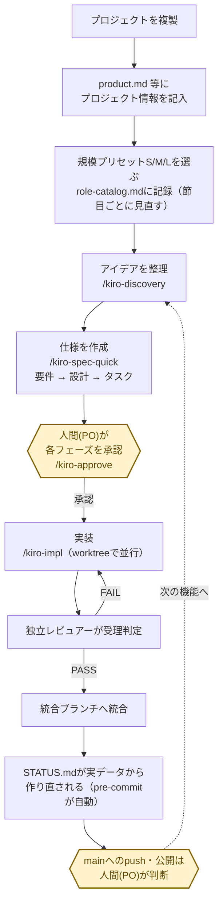
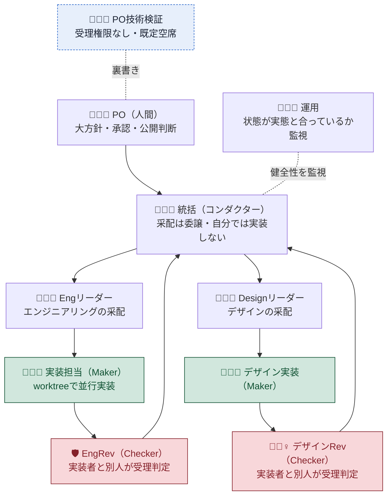
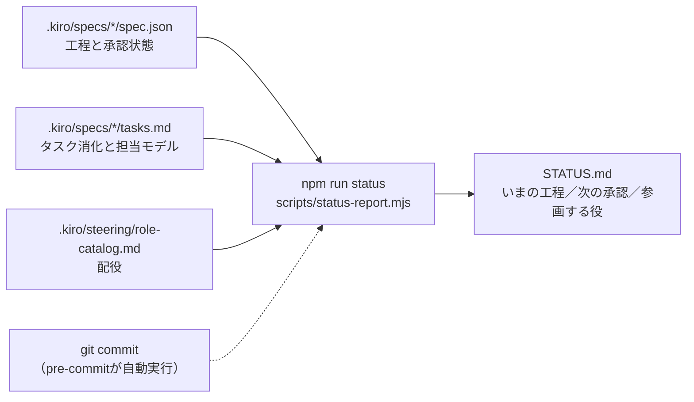
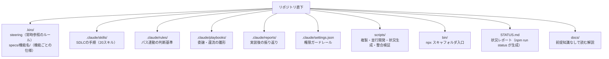

# conductor-sdlc-template

**AIエージェント主体の開発**を、コンダクター・オーケストレーション（メインのAIセッションが指揮役となり、複数のワーカーへ実装を割り振り独立レビューで受け取る体制）＋Kiro Spec-Driven Development（要件→設計→タスクの3段階承認で仕様化してから実装する進め方）で回すためのプロジェクト・テンプレート。いまの状況は `STATUS.md`（仕様と配役の実データから `npm run status` が生成する状況レポート）1枚で読む。実プロジェクト（Tauri デスクトップアプリ）で確立した手法・体制・ノウハウを、次のプロジェクトの起点として切り出したもの（経緯は [`CHANGELOG.md`](CHANGELOG.md) の「成り立ち」を参照）。

## すぐに始める

**前提**: 次の2つが要る。

- **Node.js 22.12 以上・npm 10 以上**（`node -v` / `npm -v` で確認。古ければ [nvm](https://github.com/nvm-sh/nvm) で更新）
- **Claude Code**（この手順は生成後に Claude Code で開いて進める。未導入なら `npm i -g @anthropic-ai/claude-code`。詳細は [公式ドキュメント](https://claude.com/claude-code)）

```bash
npx github:kumamoto-kouki/conductor-sdlc-template ~/projects/my-app "マイアプリ"
```

生成された新しいフォルダ（例: `~/projects/my-app`）を Claude Code で開く。

- VS Code の場合: 「ファイル > フォルダーを開く」で新しいフォルダを選ぶ
- ターミナルの場合: `cd ~/projects/my-app` してから `claude` と入力する

開いたら `/kiro-onboard` と入力する。あとは Claude Code が対話で質問しながら `product.md` 等の記入と規模プリセットの選定を順に進め、最後に `STATUS.md` を見せる。テンプレート本体のスクリプトは node 標準機能だけで動くため、`npm install` は要らない。

<details><summary>うまくいかないとき</summary>

- `could not determine executable to run` … npm が古い。nvm で 10 以上に更新する。
- `Permission denied` / `複製先ディレクトリを作成できません` … 書き込めるパス（`~/projects/<名前>`）を指定する。
- `複製先が既に存在します` … 別の新規パスにする（既存は上書きしない）。

</details>

## インストール後にすること

対象プロジェクトのフォルダで Claude Code を開き、`/kiro-onboard` と入力する。Node/npm の確認、`product.md`（と技術が決まっていれば `tech.md`）の記入、規模プリセット S/M/L の選定まで、Claude Code が対話で質問しながら代行する。テンプレート本体に `npm install` は要らない（生成プロジェクトが自分のスタックの依存を入れるかどうかは、そのプロジェクトの `package.json` 次第）。`structure.md` はコードができてから `/kiro-steering` で埋めるため、この時点では意図的に空のまま残す。詳細は `.claude/skills/kiro-onboard/SKILL.md`。

状況確認はいつでも `/kiro-spec-status {機能名}`。

<details><summary>手動で進める場合</summary>

エンジニアが手順を直接進めたい場合は、次の4ステップを自分で行う。

1. **`.kiro/steering/` の `product.md` / `tech.md` / `structure.md` を記入**（`/kiro-steering` でも可）— AI に渡る前提知識
2. **規模プリセット S/M/L を選ぶ** — `.kiro/steering/role-catalog.md`「配役表（現状）」冒頭の**採用中プリセット**行に記入し、配役表の 状態 列を合わせる（実装者(Maker)と検査者(Checker)を別人にする規律は規模に関わらず不変。PO技術検証の席はプリセットに依らず残す）
3. **最初の機能を作る**: `/kiro-discovery "アイデア"` → `/kiro-spec-quick {機能名}` → 各段階を `/kiro-approve {機能名}` で承認 → `/kiro-impl {機能名}`
4. **進捗を確認**: `npm run status` で `STATUS.md` を作り直して読む（`.kiro/specs/` や配役を変えてコミットすれば pre-commit フックが自動で作り直す）

</details>

## 全体の流れ（1周）

複製してから機能が1つ育って `STATUS.md` に反映されるまでの1周は次のとおり。人間（PO＝プロダクトオーナー）が承認するポイントを色つきで示す。



**worktree**（同じgitリポジトリを複数の作業ディレクトリへ同時展開し、並行実装時のファイル衝突を防ぐ仕組み）を使い、複数の実装が同時並行で進む。承認は人が行い、それ以外の受理判定（独立レビュー）は仕組みで回す。

承認は `/kiro-approve {機能名}` で行う。成果物を平易な日本語で要約して見せ、懸念があれば先に出したうえで可否を聞き、**承認した1段だけ**を `spec.json` に記録する。`--auto`（`/kiro-spec-quick`）・`-y`（`/kiro-spec-design`・`/kiro-spec-tasks`）・`--auto-approve`（`/kiro-spec-batch`）は**読まずに承認を飛ばす**ファストトラックであり、承認の既定手段ではない。

## 体制（誰が何をするか）

実装する人（Maker）と検査する人（Checker）は必ず別にする（自己レビュー禁止）。



図は **M（標準）プリセット**の体制。S/M/L でどの役を置くかは `.kiro/steering/role-catalog.md`「規模別プリセット（S/M/L）」を参照する。破線の 🧑🏼‍🏫 PO技術検証は統括を介さずPOへ裏書きする常設の席で、既定は空席（詳細は `.kiro/steering/role-catalog.md`「PO技術検証の charter と境界」）。

## いまの状況を見る

進捗はリポジトリ直下の `STATUS.md` を開けば分かる。**手で書く欄は無く、`npm run status` が実データから毎回作り直す生成物**である。「いまどの工程にいて、次に PO が何を承認するのか、誰が参画しているのか」がこの1枚に載る。導出元（`spec.json`）が壊れていて読み取れなかった仕様は、黙って消さずに冒頭へ「⚠ 読み取れなかった仕様」として出す。



- 読むだけならビルドもサーバも要らない。エディタでも GitHub 上でも `STATUS.md` をそのまま開く。
- `.kiro/specs/` か `.kiro/steering/role-catalog.md` を変更したコミットでは、`.githooks/pre-commit` が `STATUS.md` を作り直してコミットに含める（`git config core.hooksPath .githooks` が前提。`scripts/init-project.sh` が複製時に設定する）。更新を人の記憶に頼らせないための仕掛けである。
- 生成器は同じリポジトリ状態から常に同じ出力を返すため、`npm run verify` は「作り直して差分が出るか」で陳腐化を検知できる。
- 体制図と配役の詳細は `STATUS.md` ではなく正本を読む（体制＝`.kiro/steering/orchestration.md`、配役とフェーズ別投入計画＝`.kiro/steering/role-catalog.md`）。前提知識なしの読み方は `docs/team-structure.md`、用語は `docs/glossary.md` にある。

## 中身の地図



| 要素                   | 場所                                                   | 内容                                                                                                                                                                                                                                                                                                                                                                                                      |
| ---------------------- | ------------------------------------------------------ | --------------------------------------------------------------------------------------------------------------------------------------------------------------------------------------------------------------------------------------------------------------------------------------------------------------------------------------------------------------------------------------------------------- |
| SDLC エンジン          | `.claude/skills/kiro-*`                                | Discovery→Requirements→Design→Tasks→Approve→Impl→Review→Verify の 20 スキル                                                                                                                                                                                                                                                                                                                               |
| 体制・運用（正本）     | `.kiro/steering/`                                      | `orchestration.md`（中核モデル）／`operations.md`（運用統治）／`role-catalog.md`（配役）／`review-checklists.md`（受理観点）／`writing-standards.md`（日本語技術文書の規範）／`README.md`（索引）                                                                                                                                                                                                         |
| 判断基準（lazy）       | `.claude/rules/`                                       | パス連動で必要時だけ読む規約。同梱: `retrospective.md`／`steering-consistency.md`／`verification.md`。スタック依存の参考例は `_examples/`（先頭 `_` は glob に当たらずロードされない）                                                                                                                                                                                                                    |
| プレイブック           | `.claude/playbooks/`                                   | `delegation.md`（委譲雛形）／`full-sdlc.md`（超上流〜保守運用マッピング）／`discovery-personas.md`（代弁ペルソナ・FDE charter）／`swarm-multiprocess.md`（真マルチプロセス swarm）／`testing-strategy.md`（テスト戦略）／`model-assignment.md`（モデル選定）／`tech-selection.md`（技術選定）／`po-communication.md`（PO への報告）／`knowledge-graph.md`（大規模化判断）／`template-feedback.md`（還流） |
| セッション報告         | `.claude/reports/`                                     | 作業メモ・中間レポート。恒久内容は書いた時点で `CHANGELOG.md`／正本へ直接記録し、レポート自体は随時削除できる                                                                                                                                                                                                                                                                                             |
| ガードレール           | `.claude/settings.json`・`.claude/hooks/`              | 破壊的操作の deny・作業系の allow／`format-on-edit.mjs`（編集後の自動整形）                                                                                                                                                                                                                                                                                                                               |
| 並行開発の道具         | `scripts/`・`.githooks/`                               | `swarm-up.sh`／`swarm-down.sh`（worktree 群の起動・撤収）／`_wt-status.sh`（worktree 状況の内部ヘルパ）／`pre-commit`（`STATUS.md` の自動再生成）                                                                                                                                                                                                                                                         |
| セットアップ・還流     | `bin/`・`scripts/`・`VERSION`                          | `bin/create.mjs`（`npx` 入口の薄いラッパ）／`init-project.sh`（複製・初期化の正本）／`package.scaffold.json`（複製先へ配る `package.json`）／`collect-template-feedback.sh`（派生プロジェクトからの知見収集。派生元は `TEMPLATE_VERSION` で追跡）                                                                                                                                                         |
| 状況の可視化           | `STATUS.md`・`scripts/status-report.mjs`               | 仕様・タスク・配役から導出する状況レポート（`npm run status` が生成。手編集しない）                                                                                                                                                                                                                                                                                                                       |
| 解説ドキュメント       | `docs/`                                                | `team-structure.md`（チームの読み方）／`glossary.md`（用語集）／`pdca-practice.md`（PDCA の回し方）／`autonomy-tiers.md`（自律度の段階）／`external-services.md`（外部サービスとの関係）／`design-brief.md`（デザインブリーフの記入例）                                                                                                                                                                   |
| プロダクト記憶（雛形） | `.kiro/steering/product.md`・`tech.md`・`structure.md` | 空テンプレ（記入して使う）                                                                                                                                                                                                                                                                                                                                                                                |

npm スクリプトは `status`（`STATUS.md` の生成）と `verify`（整合性検証＝文書の相対参照の実在・`.gitignore` と `template.gitignore` の一致・`STATUS.md` が実態と一致・`spec.json` が導出元として読める・`VERSION` と `package.json` の版が一致）の2つだけで、どちらも node 標準機能だけで動く（テンプレート本体に依存パッケージは無い）。

## この進め方のルール

**委譲規律 A〜E**（実装を任せる・任された側が受け取る、それぞれの局面での判断基準。正本は `.kiro/steering/orchestration.md`）を平易に書くと次のとおり。

- **A（委譲原則）**：新機能や複数ファイルにまたがる作業は、隔離された作業コピー（**worktree**）で動く実装エージェントへ任せる。1〜2行の typo 修正のような軽微な変更だけ統括が直接行う。
- **B（証拠で受理）**：「できました」という報告だけで完了にしない。統括がテスト・ビルドを自分で再実行し、仕様の完了条件を機械的に満たすことを確認してから受理する（`kiro-verify-completion`）。
- **C（独立レビュー）**：実装した人（Maker）と検査する人（Checker）は必ず別にする（自己レビュー禁止、`kiro-review`）。
- **D（肩代わりは黙ってやらない）**：実装が詰まったら根本原因を調べる（`kiro-debug`）か別の担当へ委譲し直す。どうしても統括が代わりに手を動かす場合は、その旨を記録に残し完了報告で開示する。
- **E（開示台帳）**：委譲・レビュー判定・介入を記録し、成功だけでなく失敗・再委譲・介入も報告する。短い完了報告だけを信用せず証拠と突き合わせる。

そのほかの土台:

- **worktree 戦略（ベース是正ガード）**：実装エージェントが作業を始める前に、既存の成果物が本当に存在するかをマーカーファイル等で機械的に検証する。欠けていれば `git merge` で最新を取り込んでからやり直す（`git reset --hard` は破壊的操作なので使わせない）。詳細は `orchestration.md`。
- **信用を支える運用原則（P1〜P6）と堅実性ファースト**：ノイズは削ってよいが、安全機構・判断根拠・開示・受理ゲートは削らない。詳細は `orchestration.md`。
- **振り返りを記録する**：節目ごとに `.claude/reports/`（セッションメモ）へ振り返りを残す。バージョン記録・持ち越し事項は書いた時点で `CHANGELOG.md` へ、2回目以降も同じ判断を下す場面が来た学びは正本（`.kiro/steering/`・`.claude/rules/`）へ、それぞれ直接記録する。振り返りの基準そのものは `.claude/rules/retrospective.md`（`.claude/reports/**` に触れたときだけ読み込まれる）にある。
- **文章の規範を揃える**：日本語文書は `.kiro/steering/writing-standards.md` に従う（新規に書く文章と、変更で触れた文章から適用。既存の一括書き換えはしない）。
- **大規模化したらナレッジグラフ化を検討する**：依存関係を横断する質問（「この変更は何に影響するか」等）が頻発しだしたら `.claude/playbooks/knowledge-graph.md`（判断基準・手法マトリクス・導入手順）を参照する。

## 困ったとき・FAQ

- **Q. `npm install` はしなくてよいのか**
  A. テンプレート本体では不要（`status`・`verify` は node 標準機能だけで動く）。ただし `npx` での複製と各スクリプトの実行に **Node.js 22.12 以上**が要るので、`node -v` が古ければバージョンマネージャ（nvm 等）で切り替える。生成プロジェクトが自分のスタックの依存を入れるかどうかは、そのプロジェクトの `package.json` 次第。
- **Q. `STATUS.md` の内容が実態と違う**
  A. `npm run status` を実行して作り直す。それでも違うなら、ずれているのは導出元（`.kiro/specs/*/spec.json`・`tasks.md`・`.kiro/steering/role-catalog.md`）なので、そちらを直してから作り直す。`STATUS.md` を手で直しても次の生成で消える。
- **Q. コミットしたら `STATUS.md` が勝手に変更に加わった**
  A. `.githooks/pre-commit` が仕様・配役の変更を検知して `STATUS.md` を作り直し、ステージに加えている（意図した動作）。導出元に変更が無いコミットでは何もしない。
- **Q. Mermaid 図が表示されない**
  A. GitHub・VSCode 上で見ている場合は自動描画される。素のテキストエディタではコードブロックのまま表示されるので、GitHub か VSCode のプレビューで開く。
- **Q. `scripts/init-project.sh` が「複製先が既に存在します」で失敗する**
  A. 複製先ディレクトリが既に存在すると上書きを避けるため停止する。別のパスを指定するか、既存ディレクトリを退避してから再実行する。

## 経緯・注意

現在のバージョンは `VERSION` に書かれている。このテンプレートの**成り立ち・設計判断・バージョンごとの変更**は [`CHANGELOG.md`](CHANGELOG.md) に記録。このディレクトリで作業を続けるときは、まずそれを読む。とくに次の2つは日々の手順に直結する。

- **v0.12.0**：Astro 製ダッシュボードを撤去し、状況の正本を手書きの `status.json` から導出生成の `STATUS.md` へ反転させた。手書きの正本は日常のループで誰も更新せず、実態と食い違ったまま検知もされなかった。`STATUS.md` は仕様と配役から毎回作り直すため書き手が要らず、作り直していない状態は `npm run verify` が検知する。テンプレート本体の npm 依存はゼロになり、閲覧のためのビルドとサーバ起動も不要になった。
- **v0.10.0**：`npx` からの一発インストール導線を追加した。複製ロジックの正本は従来どおり `scripts/init-project.sh` で、`bin/create.mjs` はそれを呼ぶだけの薄いラッパ（ロジックの二重管理を避けるため）。対象は Unix 系 / WSL（bash 前提）。リポジトリを clone して使う場合は `scripts/init-project.sh <target> [name]` を直接実行してもよい。

- steering・playbooks 内の**固有名・数値・事故記号（A2/K1 等）は「例」**。教訓（なぜ）だけ受け取り、自分の実例に読み替える（各所に注記あり）。
- スタック依存の `.claude/rules/` は**実装が先・ルール化は後**で自分のスタック向けに作る（例は `_examples/`）。
- 外部ツール（agent-skills 等）の併用は「背骨を1つに絞る」（二重ツール＝理解負債を避ける）。
