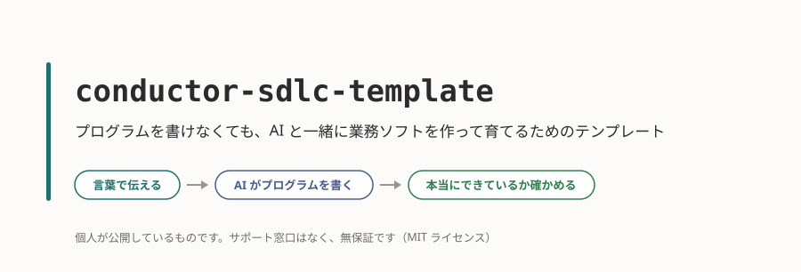
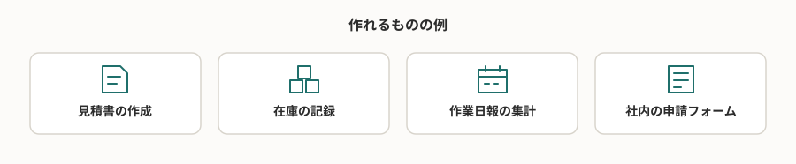
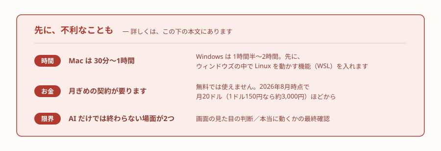
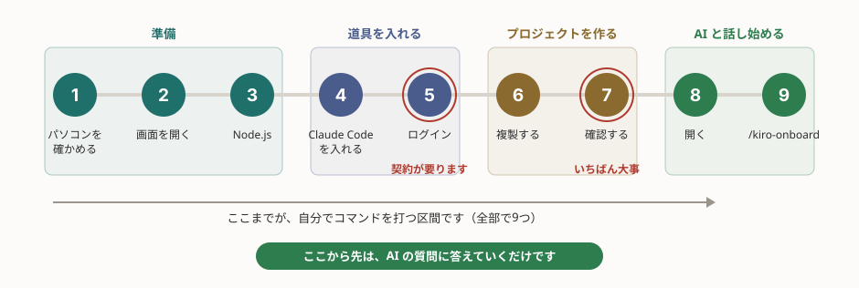
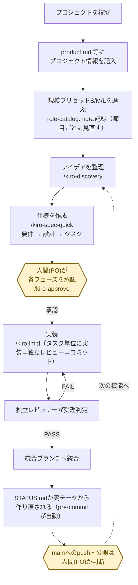
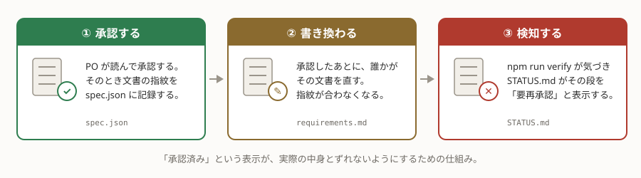
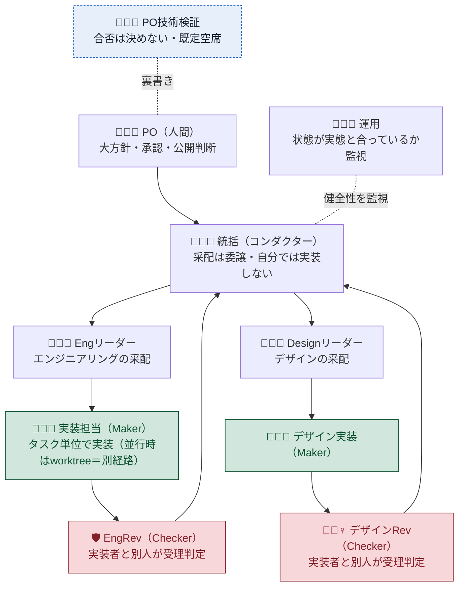
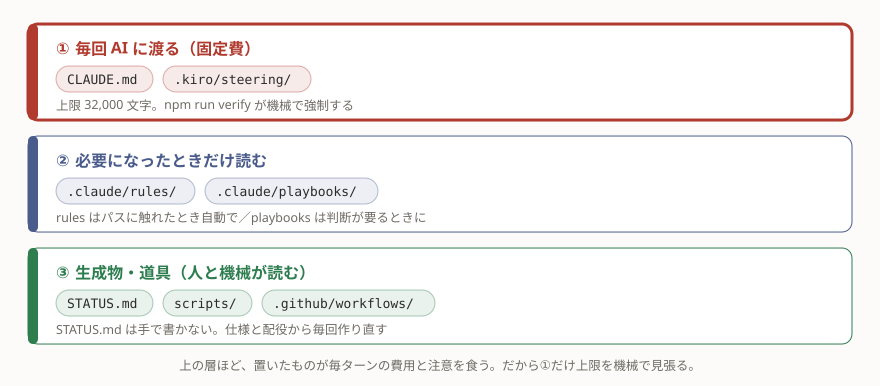

# conductor-sdlc-template



## プログラムを書けなくても、AI と一緒に業務ソフトを作って育てるためのテンプレート

作りたいものを言葉で伝えると、AI がプログラムを書きます。  
このテンプレートは、そこに**本当にできているかを確かめる仕組み**を足したものです。  
あなたがやるのは、何を作るかを決めることと、できたものを確かめて承認することです。




> 個人が公開しているものです。**サポート窓口はなく、無保証です**（MIT ライセンス。個人・法人とも自由に使えます）。

> [!NOTE]
> **この文書は3部構成です。**
>
> 1. **読んで決める**（〜「始める前に」）… やるかどうかを判断するための説明です。パソコンは触りません。
> 2. **手を動かす**（「すぐに始める」〜「インストール後にすること」）… 実際にパソコンを操作します。**触るのはこの区間だけ**です。
> 3. **仕組みを知る**（「仕組み」以降）… エンジニア向けです。読まなくても使えます。

## 始める前に

手順に入る前に、先に不利なことも含めて5点お伝えします。読んでから、やるかどうかを決めてください。



## 向いていない場合

この進め方は「AI に任せきりでは出ない確かさを、**手間**で買う」ものです。手間が見合わない場面では使わないほうがよいです。  


- **数時間で捨てる試作品** — 承認や確認の手間のほうが高くつきます。素の Claude Code で書くほうが速いです。
- **すでに大きなプログラムがあり、そこへ後から足す場合** — この仕組みは、新しく始めることを前提に作られています。既存のものを取り込む工程を持っていません。
- **プログラムを書ける人が何人もいるチーム** — 承認する人が1人である前提で作られているため、人どうしのレビューと二重になります。

迷ったら、最初の1機能だけを両方のやり方で見積もってください。そのうえで、確かめる手間に見合うだけの「失敗したときの痛手」があるかで決めます。

## お金と時間

AI（Claude Code）を使うには月ぎめの契約が要ります。**無料では使えません。**   
2026年8月時点で月20ドルほどからです。金額は変わるので、[公式の料金ページ](https://claude.com/pricing)で確認してください。  
支払い手段（クレジットカード等）が要ります。  
会社名義で契約できるか・領収書が出るかは、契約画面と公式の料金ページで確認してください。

|             | 導入（黒い画面の作業） | 最初の1機能が動くまで                |
| ----------- | ---------------------- | ------------------------------------ |
| **Mac**     | 30分〜1時間            | あなたの作業が計 数時間、数日に分散  |
| **Windows** | ＋1時間（WSL の導入）  | 同上                                 |

AI が作業している間は待ち時間なので、別の仕事ができます。作るものの大きさで変わります。  


契約を止めても、すでに作ったものは動き続けます——止まるのは支払いであって、作ったソフトではありません。  
**ただし、止めたら「直す・機能を足す」もできなくなります**。  
現場のソフトは作って終わりにならず、後から必ず「ここを変えてくれ」が出ます。そこは織り込んで判断してください。

人を雇うのに比べれば安く見えます。それは、決めることと確かめることをあなたが自分で引き受けるからです。

> [!IMPORTANT]
> 始める前に、[公式の料金ページ](https://claude.com/pricing)で Pro 以上を契約しておいてください（カードが要ります）。  
> アカウントは事前に作っておく必要があり、手順の途中では作れません。ここで止まると、下の手順5から先へ進めません。

## AI だけでは終わらない場面


どうしても人の目が要る場面が2つあります。

- **画面の見た目が良いかどうかの判断**
- **AI が「できました」と言ったものが、本当に動くかの最終確認**

パソコンに詳しい人を1人、相談できる相手として確保しておくと確実です。  
いなくても進められますが、この2つはあなたが自分で見ることになります。

## AI に送られる情報の範囲


AI に読ませたファイルの中身は、処理のために提供元のサーバーへ送信されます。図面や取引先の名前が入ったファイルを AI に開かせれば、それも送られます。

逆に、送られるのは AI に読ませたものだけです。パソコンの中が勝手に調べられることはありません。  
**見せたくないものは、作業するフォルダの外に置いておいてください。**

送られたあとの扱いは、契約の種類（個人向けか法人向けか）と設定によって変わります。具体的には次の点です。

- 保存されるのか
- AI の学習に使われるのか
- 提供元の社員が見ることがあるのか

ここは私（この文書）が代弁してよい話ではありません。  
取引先に説明する必要がある情報を扱うなら、  
[Anthropic のプライバシーポリシー](https://www.anthropic.com/legal/privacy)と[プライバシーセンター](https://privacy.claude.com/)を読んでから決めてください。

### 手を動かすのは、最初の導入だけ


打ち込む作業は、最初の導入で終わります。  
そのあと機能を作るたびに打つのは1行だけで、残りは AI の質問に答えるだけです。  
ファイルを自分で開く必要もありません。

> [!WARNING]
> サポート窓口はなく、無保証です。これは個人が公開しているもので、会社の製品ではありません。
>
> 困ったときは Claude Code 自身に聞くか、パソコンに詳しい人に相談してください。  
不具合の報告や質問は [GitHub のページ](https://github.com/kumamoto-kouki/conductor-sdlc-template)から行えます（英語である必要はありません）。
>
> ライセンスは MIT です（[`LICENSE`](LICENSE)）。個人でも会社でも、改変・商用利用ともに自由です。

---

> [!IMPORTANT]
> **ここまでが説明です。ここから下は、実際にパソコンを操作します。**
>
> ここまでは、やるかどうかを決めるための話でした。何も操作していません。  
> ここから先は、黒い画面（ターミナル）に文字を打ちます。**打つもの**と、**こう見えたら成功**を対で書いてあります。

---

## すぐに始める



**打つもの**と、**こう見えたら成功**を対で書いてあります。表示が違ったら、そのステップの下の案内を見てください。

> [!TIP]
> **書き方の約束**。`{機能名}` のような波カッコが出てきたら、カッコの中を自分の言葉に置き換えます。カッコ自体は打ちません。（例: `{機能名}` → `見積書作成`）

## 1. 自分のパソコンがどちらか確かめる

- **Mac**（画面左上にリンゴのマーク）→ そのまま 2 へ進みます。
- **Windows** → このテンプレートの導入作業は、Windows のままでは動きません。  
先に **WSL** を入れてください。WSL は、ウィンドウズの中で Linux を動かす、マイクロソフト純正の機能です。  
手順はマイクロソフトの[公式ガイド](https://learn.microsoft.com/ja-jp/windows/wsl/install)にあります。  
基本の流れは次のとおりです。

  1. スタートメニューを右クリックし、「ターミナル（管理者）」を開く
  2. `wsl --install` と打つ
  3. パソコンを再起動する

  再起動後に初めて `Ubuntu` を開くと、英語で名前とパスワードを決めるよう聞かれます。  
 好きなもので構いません（忘れないものにしてください）。  
 **パスワードは打っても画面に何も表示されませんが、ちゃんと入力されています**。  
 そのまま打って Enter を押してください。決め終わったら 2 へ進みます。

> [!NOTE]
> Windows のままで導入できるようにする改修は、今後の課題として記録してあります（[`CHANGELOG.md`](CHANGELOG.md) の「次にやること」）。

## 2. ターミナルを開く

**打つもの**: なし。アプリを開くだけです。

- **Mac**: 「アプリケーション」→「ユーティリティ」→「ターミナル」。または `Command + スペース` で検索窓を出して `ターミナル` と打つ。
- **Windows（WSL 導入後）**: スタートメニューで `Ubuntu` を検索して開く。

**こう見えたら成功**: 黒（または白）い画面が開き、末尾に `$` や `%` が付いた行で文字入力を待っている状態。

### 3. Node.js が入っているか確かめる

Node.js（ノード・ジェイエス）は、無料のソフトです。このテンプレートの複製スクリプトを動かす土台になります。これが無いと先へ進めません。

**打つもの**:

```bash
node -v
```

**こう見えたら成功**: `v22.12.0` のような、`v` で始まる数字が出て、**最初の数字が 22 以上**であること。

次のどちらかなら、下の「入れ方」を開いてください。

- `command not found` と出た … 入っていません。
- `v20.11.0` のように、最初の数字が 22 より小さい … 古いので入れ直しが要ります。

> [!CAUTION]
> 22 より小さい数字が出た場合は、`command not found` と違って一見うまくいったように見えます。  
> そのまま進むと、先で原因の分からない形で転びます。必ず入れ直してください。

<details><summary><b>▶ 数字が出なかった／22 より小さかった人はここを開く（Node.js の入れ方）</b></summary>

**方法A（かんたん・Mac 向け）**: [Node.js 公式サイト](https://nodejs.org/ja)を開きます。  
**LTS** と書かれたほうのボタンから、インストーラをダウンロードして実行します。あとは画面の指示に従って進めるだけです。

**方法B（Windows で WSL を使っている場合はこちら）**: ターミナルに次の2行を、1行ずつ順に打ちます。

```bash
curl -o- https://raw.githubusercontent.com/nvm-sh/nvm/v0.40.1/install.sh | bash
```

この1行目は、`nvm` を公式の配布元から取ってきて設置する命令です。`nvm` は、Node.js を入れたり切り替えたりするための道具です。
**こう見えたら成功**: 何行か流れたあと、`=> Close and reopen your terminal...` のような英語のメッセージが出て、入力待ちに戻る。

```bash
source ~/.bashrc && nvm install --lts
```

この2行目は、2つのことを続けて行う命令です。前半の `source ~/.bashrc` で、いま設置した道具を使えるようにします。  
後半の `nvm install --lts` で、Node.js の安定版を入れます。`&&` は「前が成功したら、続けて次をやる」という意味です。
**こう見えたら成功**: `Now using node v22.x.x` のような行が出る。

入れ終えたら、もう一度 `node -v` を打って、22 以上の数字が出ることを確かめてください。

それでも数字が出ないときは、ターミナルをいったん**閉じて開き直してから**、もう一度 `node -v` を打ってください。  
設置したものは、画面を開き直して初めて有効になることがあります。パソコンが壊れたわけではありません。

</details>

### 4. Claude Code を入れる

**打つもの**:

```bash
npm i -g @anthropic-ai/claude-code
```

（`npm` は、手順3で入れた Node.js に最初から付いてくる「ソフトを取ってきて入れる道具」です。）

何行か流れたら、入ったかどうかを次で確かめます（流れた文字を読む必要はありません）。

```bash
claude --version
```

**こう見えたら成功**: `2.1.233 (Claude Code)` のように、数字と `(Claude Code)` が出る（数字は時期によって違います）。

**`command not found` と出たら**: まずターミナルを閉じて開き直し、もう一度打ってください。  
それでも出なければ、手順3の「入れ方」からやり直します。`EACCES` や `permission denied` が出た場合は、`sudo` を付けないでください。  
手順3の**方法B**で Node.js を入れ直すと直ります。

### 5. Claude Code にログインする（契約済みのアカウントで）

**打つもの**:

```bash
claude
```

**こう見えたら成功**: ブラウザが自動で開いてログイン画面が出ます。契約したアカウントでログインすると、画面に `Login successful` と出ます。

そのあとの順番:

1. `Press Enter to continue` と出たら、**まず Enter を押します**（画面の指示どおりです）。
2. Claude Code が立ち上がって入力待ちになったら、`Ctrl` と `C` を同時に押して閉じます。これは正しい終わり方です。壊れません。  
（このあと手順6で別の作業をするため、いったん閉じます。）

- **ブラウザが開かないとき**: ターミナルに「`c` を押すとログイン用のアドレスをコピーできます」という案内が英語で出ます。  
`c` を押してコピーし、自分でブラウザに貼り付けてください。
- **Windows（WSL）の場合**: ブラウザ側にログイン用のコードが表示されることがあります。そのコードをターミナルに貼り付けてください。

### 6. テンプレートを複製する

**打つもの**（`~/projects/my-app` と `マイアプリ` の2か所を、自分の値に書き換えます）:

```bash
npx github:kumamoto-kouki/conductor-sdlc-template ~/projects/my-app "マイアプリ"
```

- `~/projects/my-app` … **作ったものを置く場所**です。

  - `~` は「自分のホームフォルダ」という意味です。
  - `~/projects/` の下に `my-app` という名前で新しいフォルダが作られます。
  - `my-app` の部分は好きな名前に変えてください（英数字とハイフンが無難です）。
- `"マイアプリ"` … **プロジェクトの表示名**。日本語で構いません。

**こう見えたら成功**: 最後に `完了:` で始まる行と、続けて「次にやること」が表示されます。

```
完了: /Users/あなたの名前/projects/my-app

次にやること:
  1. 新しいフォルダを Claude Code で開く
```

> [!NOTE]
> `完了:` の後ろの文字は人によって違います。Mac なら `/Users/…`、Windows（WSL）なら `/home/…` で始まります。  
違っていても失敗ではありません。大事なのは `完了:` と出ていることです。

**`複製先が既に存在します` と出たら**: 別の新しい名前（例: `~/projects/my-app2`）を指定してください。  
  既存のフォルダは上書きしません。その他のメッセージは、下の「導入でつまずいたときの対処」にあります。

### 7. 「完了」だけで安心しない（いちばん大事なところ）

> [!CAUTION]
> **`warn:` で始まる行が混ざっていたら、それは完全な成功ではありません**。
> このスクリプトは、途中で問題が起きても最後に `完了:` と表示します。


特に次の行が出ていた場合は、現状レポートが複製元の中身のまま残っています。つまり、あなたのプロジェクトの状況ではない、嘘の内容が表示されます。

```
warn: node が見つかりません。STATUS.md は複製元の内容のまま残ります（複製先で 'npm run status' を実行してください）
```

**対処**: 手順3に戻って Node.js を入れ直し、そのうえで次を打ちます。

```bash
cd ~/projects/my-app && npm run status
```

上の見本とは違う `warn:` が出たときは、その行をそのままコピーしてください。手順8で Claude Code を開いたあと、その行を貼り付けて「これはどうしたらいい？」と聞いてください。  
AI が読んで対処を教えてくれます。

`warn:` が1行も無ければ、そのまま 8 へ進んでください。

### 8. 新しいフォルダを Claude Code で開く

**打つもの**:

```bash
cd ~/projects/my-app
```

```bash
claude
```

（`~/projects/my-app` は手順6で自分が指定した場所に読み替えてください。）

**こう見えたら成功**: Claude Code が起動し、入力を待つ状態になる。

> [!WARNING]
> この設定では、AI はほとんどの操作をあなたに確認せず実行します（作業のたびに許可を求めていると進まないためです）。  
> 外部への公開や強制削除といった危ない操作は禁止してあります。ただし、その禁止の一覧は完全ではありません。  
> このパソコンに、失うと困るファイルが他にあるなら、設定を変えられます。AI に「毎回確認する設定に変えて」と伝えてください。これはあなたが決めてよいことです。

> [!TIP]
> VS Code というアプリを普段使っている人は、「ファイル > フォルダーを開く」で新しいフォルダを選んでも構いません。VS Code は必須ではありません。

### 9. `/kiro-onboard` と入力する

**打つもの**:

```
/kiro-onboard
```

**こう見えたら成功**: AI が質問を始めます。**ここから先、ターミナルに自分でコマンドを打つ場面はありません**。質問に日本語で答えていけば進みます。

<details><summary>導入でつまずいたときの対処（手順1〜9）</summary>

どの手順で出たかで、対処が違います。画面に出たメッセージの文字で探してください。

**手順3〜4（Node.js / Claude Code を入れるとき）**

- **`command not found`（`node -v` や `claude --version` で）**
  そのソフトがまだ入っていないか、画面に反映されていません。まずターミナルを閉じて開き直し、もう一度打ってください。
  それでも出なければ、手順3の「入れ方」からやり直します。
- **`EACCES` / `permission denied`（`npm i -g` を打ったとき）**
  Node.js の入っている場所に書き込めていません。**`sudo` を付けて実行しないでください**。後でもっと厄介になります。
  手順3の方法B（`nvm` で入れ直す）で解決します。
- **`could not determine executable to run`**
  `npm` が古いバージョンです。手順3の方法で Node.js を入れ直すと解決します。

**手順6（テンプレートを複製するとき）**

- **`error: 必須コマンドが見つかりません: ...`**
  複製に必要な道具（`rsync`・`git` など）が入っていません。ふつうは Mac にも WSL にも最初から入っています。  
無い場合は、メッセージに続けて入れ方の例が表示されます（`sudo apt install rsync git` 等）。そのとおりに打ってください。
- **`error: Windows ネイティブは未対応です。WSL（Ubuntu 等）内で bash を使って実行してください。`**
  Windows のターミナルから直接実行しています。手順1に戻って WSL を入れ、`Ubuntu` を開いてからやり直してください。
- **`複製先が既に存在します`**
  指定した場所にすでにフォルダがあります。既存のものは上書きしないので、別の新しい名前（例: `~/projects/my-app2`）を指定してください。
- **`Permission denied` / `複製先ディレクトリを作成できません`**
  書き込めない場所を指定しています。`~/projects/` の下など、自分のホームフォルダ内を指定してください。

**手順7（複製したあと）**

- **`warn:` で始まる行が出た**
  手順7を見てください。「完了」と出ていても成功ではありません。見本と違う `warn:` なら、その行をコピーして Claude Code に貼り付け、対処を聞いてください。

**ここに載っていないメッセージが出たとき**

その行をそのままコピーしておいてください。手順8まで進めたなら Claude Code に貼り付けて聞けます。  
進めないなら、パソコンに詳しい人に見せるか、  
[GitHub のページ](https://github.com/kumamoto-kouki/conductor-sdlc-template)で報告してください。

</details>

## インストール後にすること

`/kiro-onboard` と入力すると、AI が対話で導入を終わらせます。**ファイルを自分で開く必要はありません。**

**AI があなたに聞くこと**（3問＋規模の確認1問）:

1. いま何が大変か（何を解決したいか）
2. 絶対に守ること・やってはいけないこと
3. 使いたい技術の希望があるか（無ければ「おまかせ」で構いません）
4. どれくらいの規模で進めるか（規模の設定 S / M / L）

   **これは人を雇う話ではありません。** AI の役割をいくつに分けるかの設定です。費用は変わりますが、人件費は発生しません。

**AI が代わりにやること**:

- 動作環境の確認
- あなたの答えをもとにした、前提知識ファイルの記入
- 役割の記録
- 現状レポート（`STATUS.md`）の作成

### このあと、ずっと繰り返すこと

導入が終わったら、あとはこの3つの繰り返しです。**打つのは1行だけで、残りは会話です。**


1. **作りたいことを言う** — `/kiro-discovery "作りたいこと"` と打つ。AI が質問しながら中身を詰めます。
2. **読んで承認する** — AI が「何を作るか」「どう作るか」「どんな順で作るか」を日本語でまとめて見せます。3回、あなたが承認します。  
   分からなければ「分からん」と言えば書き直します。
3. **できたものを確かめる** — AI が作り、別の AI が検査します。最後にあなたが実際に動かして確かめます。

いまどこまで進んだかを知りたくなったら、いつでも `/kiro-spec-status {機能名}` と打つか、フォルダの中の `STATUS.md` を開いてください。

---

> [!IMPORTANT]
> **🏁 プロダクトオーナーの方は、ここまでで大丈夫です**
>
> あとは `/kiro-onboard` から AI の質問に答えていけば進みます。
> **これより下は、この仕組みがどう動いているかのエンジニア向けの説明です。読まなくても使えます。**

---

## 仕組み

### 何を解こうとしているのか

素の Claude Code に「作って」と頼むと、実装は速い。問題はそのあとにある。**何を作るはずだったのかが残らず、できたと言われたものが本当にできているかを確かめる手立てが無い**。  
作った本人（AI）が「できました」と言い、それを検証するのも同じ本人になる。規模が小さいうちは動くが、機能が増えると「動いていたはずのもの」が静かに壊れ、誰も気づかない。

このテンプレートは、その2点だけを構造で塞ぐ。

- **決めたことを残す** — **Kiro Spec-Driven Development**（要件 → 設計 → タスクの3段階で仕様化し、各段で人が承認してから実装へ進む）。  
  承認は文書のハッシュとともに記録されるので、承認後に中身が書き換わると機械が検知する。
- **作った本人に合格を出させない** — **コンダクター・オーケストレーション**（メインの AI セッションが指揮役となり、実装は別のワーカーへ委譲し、  
  検査はさらに別のワーカーが行う）。指揮役は自分では実装せず、証拠を再実行して受け取る。

いまの状況は `STATUS.md`（仕様と配役の実データから `npm run status` が生成する状況レポート）1枚で読む。  
実プロジェクト（Tauri デスクトップアプリ）で確立した手法・体制・ノウハウを、  
次のプロジェクトの起点として切り出したもの（経緯は [`CHANGELOG.md`](CHANGELOG.md) の「成り立ち」を参照）。

**採用に向かない場合**は前半の「[向いていない場合](#向いていない場合)」に書いた3つ（使い捨ての試作・既存大規模への後付け・人間のエンジニアが複数いるチーム）と同じである。  
加えて、テストを書けない領域（外部サービスの挙動に全面依存する等）では規律 B（証拠で受理）が空回りするため、受理基準を人の目視に置き換える判断が要る。

### 全体の流れ（1周）

複製してから機能が1つ育って `STATUS.md` に反映されるまでの1周は次のとおり。人間（PO＝プロダクトオーナー）が承認するポイントを色つきで示す。



`/kiro-impl` はタスクを順に処理し、1つずつ独立レビューを通してからコミットする（git の衝突を避け、受理の境界を明確に保つため）。  
複数の機能を**同時並行**で進めたいときは **worktree**（同じ git リポジトリを複数の作業ディレクトリへ同時展開する仕組み）  
を使う別経路がある（`.claude/playbooks/worktree-strategy.md`・`scripts/swarm-up.sh`）。  
承認は人が行い、それ以外の受理判定（独立レビュー）は仕組みで回す。

### 承認は、あとから書き換わったことを検知できる

承認は `/kiro-approve {機能名}` で行う。  
成果物を平易な日本語で要約して見せ、懸念があれば先に出したうえで可否を聞き、**承認した1段だけ**を `spec.json` に記録する。



`--auto`（`/kiro-spec-quick`）・`-y`（`/kiro-spec-design`・`/kiro-spec-tasks`）・  
`--auto-approve`（`/kiro-spec-batch`）は**読まずに承認を飛ばす**ファストトラックであり、承認の既定手段ではない。

### 体制（誰が何をするか）

実装する人（Maker）と検査する人（Checker）は必ず別にする（自己レビュー禁止）。



図は **M（標準）プリセット**の体制。S/M/L でどの役を置くかは `.claude/playbooks/casting.md`「規模別プリセット（S/M/L）」を参照する。  
破線の 🧑🏼‍🏫 PO技術検証は統括を介さずPOへ裏書きする常設の席で、  
既定は空席（詳細は `.kiro/steering/role-catalog.md`「PO技術検証の charter と境界」）。

### 手で進める場合

エンジニアが `/kiro-onboard` を使わず手順を直接進めたい場合は、次の4ステップを自分で行う。

1. **`.kiro/steering/` の `product.md` / `tech.md` / `structure.md` を記入**（`/kiro-steering` でも可）  
   — AI に渡る前提知識
2. **規模プリセット S/M/L を選ぶ** — `.kiro/steering/role-catalog.md`「配役表（現状）」冒頭の**採用中プリセット**行に記入し、配役表の 状態 列を合わせる  
（実装者(Maker)と検査者(Checker)を別人にする規律は規模に関わらず不変。PO技術検証の席はプリセットに依らず残す）
3. **最初の機能を作る**: `/kiro-discovery "アイデア"` → `/kiro-spec-quick {機能名}` →   
   各段階を `/kiro-approve {機能名}` で承認 → `/kiro-impl {機能名}`
4. **進捗を確認**: `npm run status` で `STATUS.md` を作り直して読む（`.kiro/specs/` や配役を変えてコミットすれば pre-commit   
   フックが自動で作り直す）

テンプレート本体のスクリプトは node 標準機能だけで動くため、`npm install` は要らない  
（生成プロジェクトが自分のスタックの依存を入れるかどうかは、そのプロジェクトの `package.json` 次第）。
`structure.md` はコードができてから `/kiro-steering` で埋めるため、この時点では意図的に空のまま残す。  
詳細は `.claude/skills/kiro-onboard/SKILL.md`。

## 日々の運用

### 進捗の見方 ── `STATUS.md` 1枚で読む

進捗はリポジトリ直下の `STATUS.md` を開けば分かる。**手で書く欄は無い**。  
`npm run status` が実データ（`.kiro/specs/*/spec.json`・`tasks.md`・  
`.kiro/steering/role-catalog.md`）から毎回作り直す生成物である。

「いまどの工程にいて、次に PO が何を承認するのか、誰が参画しているのか」がこの1枚に載る。あわせて次の3つも出る。

- **止まっている機能** — 実装が人の判断待ちで停止したもの
- **独立レビューの結果と回数**
- **あなたにしか決められないこと** — 調べても答えの出ない、PO の業務・費用・リスクの判断

導出元が壊れていて読み取れなかった仕様は、黙って消さずに冒頭へ「⚠ 読み取れなかった仕様」として出す。

- 読むだけならビルドもサーバも要らない。エディタでも GitHub 上でも `STATUS.md` をそのまま開く。
- `.kiro/specs/` か `.kiro/steering/role-catalog.md` を変更したコミットでは、  
  `.githooks/pre-commit` が `STATUS.md` を作り直してコミットに含める（`git config core.hooksPath .githooks`   
が前提。`scripts/init-project.sh` が複製時に設定する）。更新を人の記憶に頼らせないための仕掛けである。
- 生成器は同じリポジトリ状態から常に同じ出力を返すため、`npm run verify` は「作り直して差分が出るか」で陳腐化を検知できる。
- 体制図と配役の詳細は `STATUS.md` ではなく正本を読む（体制＝`.kiro/steering/orchestration.md`、  
  配役＝`.kiro/steering/role-catalog.md`、フェーズ別投入計画＝`.claude/playbooks/casting.md`）。  
  前提知識なしの読み方は `docs/team-structure.md`、用語は `docs/glossary.md` にある。

### ディレクトリの地図

置き場所は「**AI に読まれる頻度**」で3層に分かれる。上の層ほど毎ターンの費用と注意を食うため、①だけ上限を機械で見張っている。



| 要素                   | 場所                                        | 内容                                             |
| ---------------------- | ------------------------------------------- | ------------------------------------------------ |
| SDLC エンジン          | `.claude/skills/kiro-*`                     | 仕様策定から検証までの 20 スキル                 |
| 体制・運用（正本）     | `.kiro/steering/`                           | 体制・運用・配役・受理観点・文章規範の正本       |
| 判断基準（必要時）     | `.claude/rules/`                            | パスに触れたとき読む規約。参考例は `_examples/`  |
| プレイブック           | `.claude/playbooks/`                        | 委譲・配役・報告などの雛形。必要なときだけ読む   |
| セッション報告         | `.claude/reports/`                          | 作業メモ。恒久内容は正本へ移してから削除する     |
| ガードレール           | `.claude/settings.json`・`.claude/hooks/`   | 破壊的操作の禁止と、編集後の自動整形             |
| 定期点検の台帳         | `.claude/maintenance.json`                  | 棚卸しの実施日。90日放置で `verify` が催促する   |
| 並行開発の道具         | `scripts/`・`.githooks/`                    | worktree の起動・撤収と、`STATUS.md` の自動再生成 |
| セットアップ・還流     | `bin/`・`scripts/`・`VERSION`               | 複製の入口と正本、派生からの知見収集             |
| 状況の可視化           | `STATUS.md`・`scripts/status-report.mjs`    | 実データから導出する状況レポート（手編集しない） |
| CI                     | `.github/workflows/`                        | push と PR で `verify` を自動実行する            |
| 解説ドキュメント       | `docs/`                                     | 前提知識なしで読む解説6本と、README 用の図       |
| プロダクト記憶（雛形） | `.kiro/steering/product.md` ほか2本         | 空テンプレ（記入して使う）                       |
| ライセンス             | `LICENSE`                                   | MIT。本体のみ（生成プロジェクトへは複製しない）  |

npm スクリプトは `status`（`STATUS.md` の生成）と `verify`（整合性検証ハーネス）の2つだけ。  
どちらも node 標準機能だけで動く（テンプレート本体に依存パッケージは無い）。

`verify` については、**検査の一覧と各検査の狙いは実行時の出力自身が示す**。  
ここに列挙すると増減のたびに古びるため書かない——過去に2度、この説明が実際の検査数から取り残された。

### AI に任せるときの規律（A〜E）

実装を任せる側・任された側それぞれの局面での判断基準。正本は `.kiro/steering/orchestration.md`。

- **A（委譲原則）**：新機能や複数ファイルにまたがる作業は、隔離された作業コピー（**worktree**）で動く実装エージェントへ任せる。  
  1〜2行の typo 修正のような軽微な変更だけ統括が直接行う。
- **B（証拠で受理）**：「できました」という報告だけで完了にしない。  
  統括がテスト・ビルドを自分で再実行し、仕様の完了条件を機械的に満たすことを確認してから受理する（`kiro-verify-completion`）。
- **C（独立レビュー）**：実装した人（Maker）と検査する人（Checker）は必ず別にする（自己レビュー禁止、`kiro-review`）。
- **D（肩代わりは黙ってやらない）**：実装が詰まったら根本原因を調べる（`kiro-debug`）か別の担当へ委譲し直す。  
  どうしても統括が代わりに手を動かす場合は、その旨を記録に残し完了報告で開示する。
- **E（開示台帳）**：委譲・レビュー判定・介入を記録し、成功だけでなく失敗・再委譲・介入も報告する。短い完了報告だけを信用せず証拠と突き合わせる。

### そのほかの土台

- **worktree 戦略（ベース是正ガード）**：実装エージェントが作業を始める前に、既存の成果物が本当に存在するかをマーカーファイル等で機械的に検証する。  
  欠けていれば `git merge` で最新を取り込んでからやり直す（`git reset --hard` は破壊的操作なので使わせない）。  
  判断基準は `orchestration.md`、実際の worktree 運用は `.claude/playbooks/worktree-strategy.md`。
- **信用を支える運用原則（P1〜P6）と堅実性ファースト**：ノイズは削ってよいが、安全機構・判断根拠・開示・受理ゲートは削らない。詳細は `orchestration.md`。
- **振り返りを記録する**：節目ごとに `.claude/reports/`（セッションメモ）へ振り返りを残す。  
  バージョン記録・持ち越し事項は書いた時点で `CHANGELOG.md` へ、  
  2回目以降も同じ判断を下す場面が来た学びは正本（`.kiro/steering/`・`.claude/rules/`）へ、それぞれ直接記録する。  
  振り返りの基準そのものは `.claude/rules/retrospective.md`（`.claude/reports/**` に触れたときだけ読み込まれる）にある。
- **文章の規範を揃える**：日本語文書は `.kiro/steering/writing-standards.md` に従う（新規に書く文章と、変更で触れた文章から適用。  
  既存の一括書き換えはしない）。
- **大規模化したらナレッジグラフ化を検討する**：依存関係を横断する質問（「この変更は何に影響するか」等）  
  が頻発しだしたら `.claude/playbooks/knowledge-graph.md`（判断基準・手法マトリクス・導入手順）を参照する。

## 参考

### FAQ（運用中に出る疑問）

- **Q. `npm install` はしなくてよいのか**
  A. テンプレート本体では不要（`status`・`verify` は node 標準機能だけで動く）。  
ただし `npx` での複製と各スクリプトの実行に **Node.js 22.12 以上**が要るので、`node -v` が古ければバージョンマネージャ（nvm 等）で切り替える。  
生成プロジェクトが自分のスタックの依存を入れるかどうかは、そのプロジェクトの `package.json` 次第。
- **Q. `STATUS.md` の内容が実態と違う**
  A. `npm run status` を実行して作り直す。  
それでも違うなら、  
ずれているのは導出元（`.kiro/specs/*/spec.json`・`tasks.md`・`.kiro/steering/role-catalog.md`）なので、  
そちらを直してから作り直す。`STATUS.md` を手で直しても次の生成で消える。
- **Q. コミットしたら `STATUS.md` が勝手に変更に加わった**
  A. `.githooks/pre-commit` が仕様・配役の変更を検知して `STATUS.md` を作り直し、ステージに加えている（意図した動作）。  
導出元に変更が無いコミットでは何もしない。
- **Q. `STATUS.md` に「要再承認」と出た**
  A. あなたが承認したあとに、その文書の中身が変わっている（`npm run verify` も失敗する）。  
変更が正しいなら読み直して `/kiro-approve {機能名} {段}` で再承認する。意図しない変更なら戻す。  
承認を真偽値だけで持つと「承認済み」の表示が中身とずれるため、承認時の内容を照合している。
- **Q. `npm run verify` が「常時ロードの予算」で失敗する**
  A. `CLAUDE.md` と `.kiro/steering/` は毎回まるごと AI に渡る固定費なので、上限を設けている。  
条件付きでよい内容を `.claude/rules/`（必要なときだけ読む）か `.claude/playbooks/` へ移す。  
本当に毎回必要なら `scripts/verify.mjs` の予算定数を上げる——ただしそれは「決めて増やす」操作なので、理由をコミットメッセージに残す。
- **Q. 「点検の鮮度」で警告が出た**
  A. 定期点検（常時ロードの観測・不要ルールの掃除・steering の陳腐化点検・モデル世代への適合点検）が90日以上放置されている。  
`.claude/playbooks/full-sdlc.md` の定常運用に沿って実施し、`.claude/maintenance.json` の日付を更新する。  
失敗ではなく催促なので、作業は止まらない。
- **Q. Mermaid 図が表示されない**
  A. GitHub・VSCode 上で見ている場合は自動描画される。素のテキストエディタではコードブロックのまま表示されるので、GitHub か VSCode のプレビューで開く。
- **Q. `scripts/init-project.sh` が「複製先が既に存在します」で失敗する**
  A. 複製先ディレクトリが既に存在すると上書きを避けるため停止する。別のパスを指定するか、既存ディレクトリを退避してから再実行する。

### 版のハイライト

現在のバージョンは `VERSION` に書かれている。成り立ち・設計判断・バージョンごとの変更は [`CHANGELOG.md`](CHANGELOG.md) に記録。  
このディレクトリで作業を続けるときは、まずそれを読む。とくに次の3つは日々の手順に直結する。

- **v0.13.0**：README を非エンジニアが導入できる形へ作り直した。  
  導入手順を「打つもの／こう見えたら成功」の対にし、実際に詰まる分岐（Node.js のバージョン不足・WSL・課金・`warn:` の見落とし）に行き先を与えた。
- **v0.12.0 以降（ハーネス最適化）**：ハーネスを「散文で縛る」から「検証で担保する」へ寄せた。  
  実測で、統括（AI）が犯した誤りを**散文の規律は1件も事前に止めておらず**、止めたのは独立レビューと機械チェックと人間だけだった。  
  そこで検査を増やし（承認後の文書改変の検知・定期点検の放置の催促・常時ロードの予算・委譲プロンプトのガード）、CI で自動実行するようにし、  
  代わりに一般知識の教科書と判断を縛る指示を削った。
- **v0.12.0**：Astro 製ダッシュボードを撤去し、状況の正本を手書きの `status.json` から導出生成の `STATUS.md` へ反転させた。  
  手書きの正本は日常のループで誰も更新せず、実態と食い違ったまま検知もされなかった。テンプレート本体の npm 依存はゼロになり、閲覧のためのビルドとサーバ起動も不要になった。
- **v0.10.0**：`npx` からの一発インストール導線を追加した。  
  複製ロジックの正本は従来どおり `scripts/init-project.sh` で、  
  `bin/create.mjs` はそれを呼ぶだけの薄いラッパ（ロジックの二重管理を避けるため）。対象は Unix 系 / WSL（bash 前提）。  
  リポジトリを clone して使う場合は `scripts/init-project.sh <target> [name]` を直接実行してもよい。

### 使うときの注意

- steering・playbooks 内の**固有名・数値・事故記号（A2/K1 等）は「例」**。教訓（なぜ）だけ受け取り、自分の実例に読み替える（各所に注記あり）。
- スタック依存の `.claude/rules/` は**実装が先・ルール化は後**で自分のスタック向けに作る（例は `_examples/`）。
- 外部ツール（agent-skills 等）の併用は「背骨を1つに絞る」（二重ツール＝理解負債を避ける）。
