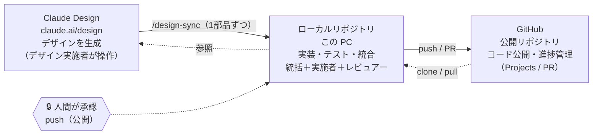

# 外部サービスとの関係

コードが行き来する先と、そこに人間の承認がどう挟まるかを示す。

- **Claude Design（claude.ai/design）** — デザインを会話で生成する場所。デザイン実施者が操作し、結果を `/design-sync` で**1部品ずつ**ローカルへ取り込む。新規課金は不要だが共通の利用枠を消費する。
- **ローカルリポジトリ（この PC）** — 実装・テスト・統合の中心。統括・実施者・レビュアーが動く。
- **GitHub** — コードを公開し進捗（Projects / PR）を管理する先。**push（公開）は人間が承認**してから行う。AI は push しない。

push を人間の承認事項とする根拠は、権限境界として [`.kiro/steering/orchestration.md`](../.kiro/steering/orchestration.md) に正本がある。
