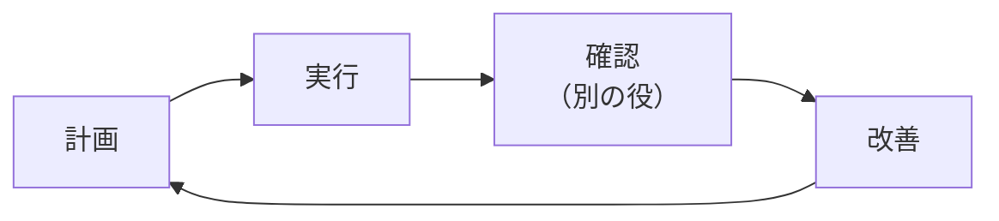

# PDCA の回し方

計画 → 実行 → 確認 → 改善 を1周とし、確認は**必ず作った役以外**が行う。

## 例① 品質の点検

| 段階 | 内容                                                                     |
| ---- | ------------------------------------------------------------------------ |
| 計画 | プロダクトを点検・検証・記録する計画を立てる                             |
| 実行 | 実装と記録のあと、別の担当役（独立チェック）で再点検                     |
| 確認 | チェック役が本物のバグ・通信制限の未設定・仕様の食い違いを発見           |
| 改善 | 3件を修正 → 再テストで全合格                                             |

## 例② 作業の任せ方の試行

| 段階 | 内容                                                                       |
| ---- | -------------------------------------------------------------------------- |
| 計画 | 新コマンドの実装を別の作業役（AI）に任せてみる                             |
| 実行 | 作業用の別コピー（worktree）で実装し、専用ブランチに記録                   |
| 確認 | 別のチェック役が合格判定。取りまとめ役もテストを自分で実行し直して確認     |
| 改善 | 本体に統合し、つまずいた点を運用ルールに反映                               |

いずれも実プロジェクトでの例であり、件数や対象ファイルはそのプロジェクト固有のものである。

振り返りの基準は [`.claude/rules/retrospective.md`](../.claude/rules/retrospective.md) を参照。
